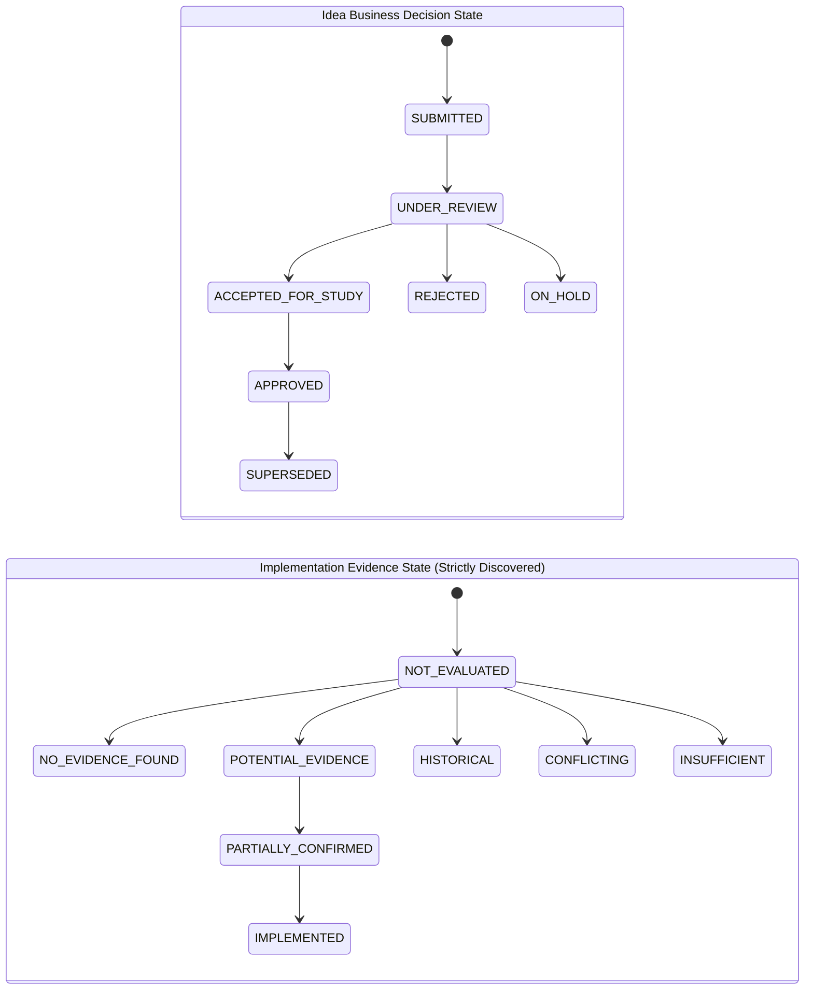

# Phase 4 Completion Report: Ideathon Domain Engine, Taxonomy & Normalization

**Authoritative Baseline**: `docs/implementation-plan/09_REVISED_IMPLEMENTATION_PLAN_V3_1_1.md`  
**Decision Gate**: `GATE-04: Ideathon Normalization, Taxonomy & Clustering Baseline Verified`  
**Execution Date**: 2026-08-31  
**Status**: **COMPLETED & VALIDATED**

---

## 1. Summary of Work Accomplished

Phase 4 has delivered the complete, production-grade **Vehicle Ideathon Domain Engine, Engineering Taxonomy, Entity Extraction & Normalization Pipeline** for the **HERO Vehicle Cost Intelligence Platform**.

### 1.1 Business Scope & Boundaries
- Strictly vehicle / product cost reduction domain (Splendor, HF Deluxe, Glamour, Passion, Xpulse, Xtreme, Vida V1, Zoom).
- Kept completely separate from Plant OPEX business logic.
- Zero SCADA, PLC, MQTT, or industrial control concepts introduced.

### 1.2 Core Components Delivered
1. **Ideathon Data Models & Dual State Architecture** (`database/models/ideathon.py`):
   - `IdeaSubmission`: Preserves immutable raw text alongside normalized taxonomy, foreign key links to vehicle hierarchy (`Vehicle`, `VehicleModel`, `Part`, `Component`, `Subsystem`), confidence scores, and dual states.
   - `IdeaCluster`: Groups related ideas by part and category.
   - `IdeaDuplicateLink`: Identifies duplicate pairs with similarity scores and type classifications (`EXACT_DUPLICATE`, `NEAR_DUPLICATE_SAME_VEHICLE`, `CROSS_VEHICLE_SYNERGY`).
2. **Dual State Taxonomy Implemented**:
   - **Idea Decision State** (`IdeaDecisionState`):
     `SUBMITTED` $\rightarrow$ `UNDER_REVIEW` $\rightarrow$ `ACCEPTED_FOR_STUDY` $\rightarrow$ `APPROVED` $\rightarrow$ `ON_HOLD` $\rightarrow$ `REJECTED` $\rightarrow$ `SUPERSEDED`.
   - **Implementation Evidence State** (`ImplementationEvidenceState`):
     `NOT_EVALUATED` $\rightarrow$ `NO_EVIDENCE_FOUND` $\rightarrow$ `POTENTIAL_EVIDENCE` $\rightarrow$ `PARTIALLY_CONFIRMED` $\rightarrow$ `IMPLEMENTED` $\rightarrow$ `HISTORICAL` $\rightarrow$ `CONFLICTING` $\rightarrow$ `INSUFFICIENT`.
     *(Maintains strict separation: "no implementation found" does NOT mean "not implemented").*
   - **Data Quality & Ambiguity Taxonomy** (`DataQualityStatus`):
     `COMPLETE`, `AMBIGUOUS_VEHICLE`, `AMBIGUOUS_COMPONENT`, `MISSING_DATA`, `REQUIRES_HUMAN_REVIEW`.
3. **Engineering Taxonomy & Synonym Dictionaries** (`ai/ideathon/taxonomy.py`):
   - Vehicle model synonyms (`VEHICLE_MODEL_ALIASES` for Splendor+, HF Deluxe, Glamour, Passion+, Xpulse 200, Xtreme 160R, Vida V1, Zoom 110).
   - Component & subsystem synonyms (`COMPONENT_SYNONYMS` for Cylinder Head Cover, Piston Pin, Handlebar Weight, Main Stand, Side Stand, Front Fender, Chain Cover, Fasteners).
   - Automotive standard part number regex matching (`11100-KCC-900`, `53100-KTR-900`, `13111-087-000`).
   - Cost reduction category keyword classifiers (`MATERIAL_SUBSTITUTION`, `GEOMETRY_OPTIMIZATION`, `FASTENER_CONSOLIDATION`, `PROCESS_SIMPLIFICATION`, `LOCAL_SOURCING`, `PACKAGING_LOGISTICS`, `FEATURE_RATIONALIZATION`, `OTHER_VAVE`).
4. **Ideathon Normalizer & Decomposition Pipeline** (`ai/ideathon/normalizer.py`):
   - Problem / Solution / Expected Benefit decomposition.
   - Deterministic entity & part matching against relational master data.
   - BOM linkage classification (`is_bom_linked`).
   - Stemmed token & title duplicate similarity scoring.
5. **Ideathon Service & REST API** (`backend/app/services/ideathon/ideathon_service.py` & `backend/app/api/v1/endpoints/ideathon.py`):
   - `POST /api/v1/ideathon/submit`: Ingests, normalizes, detects duplicates, and persists submissions.
   - `GET /api/v1/ideathon/ideas`: Lists ideas with decision state and data quality filters.
   - `GET /api/v1/ideathon/review-queue`: Filters low-confidence or ambiguous submissions requiring engineer review.
   - `GET /api/v1/ideathon/ideas/{id}`: Full idea detail with duplicate links.
6. **Alembic Migration 0003** (`database/migrations/versions/0003_ideathon_domain_and_taxonomy.py`):
   - Created tables and PostgreSQL GIN trigram indexes (`ix_idea_submissions_title_trgm`, `ix_idea_submissions_part_trgm`).

---

## 2. Implemented Idea Decision-State Model vs Evidence-State Model



---

## 3. Synthetic Normalized Idea Examples

### Example 1: High-Confidence Geometry Optimization
- **Raw Title**: *"Reduce cylinder head cover thickness on Splendor Plus"*
- **Raw Description**: *"Problem: High mass on 11100-KCC-900. Solution: Reduce wall thickness by 0.7mm. Saving: Rs 3.50 per vehicle."*
- **Decomposed Problem**: *"High mass on 11100-KCC-900."*
- **Decomposed Solution**: *"Reduce wall thickness by 0.7mm."*
- **Decomposed Benefit**: *"Rs 3.50 per vehicle."*
- **Extracted Vehicle**: `SPLENDOR_PLUS` (Linked to `VehicleModel.id: vmod-01`)
- **Extracted Part**: `11100-KCC-900` (Linked to `Part.id: part-01`)
- **Category**: `GEOMETRY_OPTIMIZATION`
- **Data Quality**: `COMPLETE` (Confidence: `0.96`)
- **States**: `decision_state = SUBMITTED`, `evidence_state = NOT_EVALUATED`

### Example 2: Fastener Consolidation with Synonym
- **Raw Title**: *"HF-Deluxe eco center stand bracket simplification"*
- **Raw Description**: *"Replace stand comp main fastener with snap fit clip."*
- **Extracted Vehicle**: `HF_DELUXE`
- **Extracted Component**: `MAIN_STAND`
- **Category**: `FASTENER_CONSOLIDATION`
- **Data Quality**: `COMPLETE` (Confidence: `0.88`)

### Example 3: Ambiguous Vehicle Submission (Routed to Review Queue)
- **Raw Title**: *"Optimize piston pin machining cycle time"*
- **Raw Description**: *"Eliminate secondary grinding on piston pin 13111-087-000 across lines."*
- **Extracted Part**: `13111-087-000`
- **Extracted Vehicle**: `None`
- **Category**: `PROCESS_SIMPLIFICATION`
- **Data Quality**: `AMBIGUOUS_VEHICLE` (Confidence: `0.60`) $\rightarrow$ **Routed to `/ideathon/review-queue`**

---

## 4. Files Created & Modified

| File Path | Description |
|---|---|
| [`database/models/ideathon.py`](file:///d:/MY%20APPS/hero-cost-intelligence/database/models/ideathon.py) | Database models for IdeaSubmission, IdeaCluster, IdeaDuplicateLink, and dual state enums. |
| [`database/models/__init__.py`](file:///d:/MY%20APPS/hero-cost-intelligence/database/models/__init__.py) | Exported Ideathon models in master database registry. |
| [`database/migrations/versions/0003_ideathon_domain_and_taxonomy.py`](file:///d:/MY%20APPS/hero-cost-intelligence/database/migrations/versions/0003_ideathon_domain_and_taxonomy.py) | Migration 0003 creating Ideathon tables and trigram indexes. |
| [`ai/ideathon/taxonomy.py`](file:///d:/MY%20APPS/hero-cost-intelligence/ai/ideathon/taxonomy.py) | Engineering taxonomy, vehicle aliases, component synonyms, and category keyword rules. |
| [`ai/ideathon/normalizer.py`](file:///d:/MY%20APPS/hero-cost-intelligence/ai/ideathon/normalizer.py) | Decomposition, entity extraction, data quality assessment, and similarity scoring engine. |
| [`backend/app/services/ideathon/ideathon_service.py`](file:///d:/MY%20APPS/hero-cost-intelligence/backend/app/services/ideathon/ideathon_service.py) | Ideathon master service orchestrating normalization, foreign key resolution, duplicate links, and review queue. |
| [`backend/app/api/v1/endpoints/ideathon.py`](file:///d:/MY%20APPS/hero-cost-intelligence/backend/app/api/v1/endpoints/ideathon.py) | REST API endpoints for idea submission, listing, review queue, and details. |
| [`backend/app/api/v1/router.py`](file:///d:/MY%20APPS/hero-cost-intelligence/backend/app/api/v1/router.py) | Registered Ideathon router with API v1. |
| [`tests/unit/test_ideathon_normalizer.py`](file:///d:/MY%20APPS/hero-cost-intelligence/tests/unit/test_ideathon_normalizer.py) | Unit tests for wording variations, synonyms, ambiguity handling, categories, and duplicate scoring. |
| [`tests/integration/test_ideathon_service.py`](file:///d:/MY%20APPS/hero-cost-intelligence/tests/integration/test_ideathon_service.py) | Integration tests for database persistence, master data linking, and duplicate linkage. |
| [`tests/integration/test_ideathon_api.py`](file:///d:/MY%20APPS/hero-cost-intelligence/tests/integration/test_ideathon_api.py) | Integration tests for `/api/v1/ideathon` endpoints. |

---

## 5. Test Execution & Results (64/64 Tests Passed in 9.64s)

```text
============================= test session starts =============================
platform win32 -- Python 3.14.3, pytest-9.1.1, pluggy-1.6.0 -- D:\MY APPS\hero-cost-intelligence\.venv\Scripts\python.exe
cachedir: .pytest_cache
rootdir: D:\MY APPS\hero-cost-intelligence
configfile: pyproject.toml
plugins: anyio-4.14.2, asyncio-1.4.0, cov-7.1.0

tests/integration/test_health_api.py::test_health_endpoint PASSED        [  1%]
tests/integration/test_health_api.py::test_readiness_endpoint PASSED     [  3%]
tests/integration/test_health_api.py::test_air_gap_egress_blocking_middleware PASSED [  4%]
tests/integration/test_hierarchy_api.py::test_get_master_data_summary PASSED [  6%]
tests/integration/test_hierarchy_api.py::test_get_part_lineage_api PASSED [  7%]
tests/integration/test_hierarchy_service.py::test_full_lineage_and_applicability_traversal PASSED [  9%]
tests/integration/test_ideathon_api.py::test_submit_idea_api PASSED      [ 10%]
tests/integration/test_ideathon_api.py::test_list_ideas_and_review_queue_api PASSED [ 12%]
tests/integration/test_ideathon_service.py::test_submit_and_normalize_idea_service PASSED [ 14%]
tests/integration/test_ideathon_service.py::test_duplicate_linking_on_submission PASSED [ 15%]
tests/integration/test_ideathon_service.py::test_human_review_queue PASSED [ 17%]
tests/integration/test_ingestion_api.py::test_get_templates_api PASSED   [ 18%]
tests/integration/test_ingestion_api.py::test_upload_dry_run_api PASSED  [ 20%]
tests/integration/test_ingestion_service.py::test_ingest_plant_opex_csv_live_and_audit PASSED [ 21%]
tests/integration/test_opex_api.py::test_get_plant_kpis_api PASSED       [ 23%]
tests/integration/test_opex_api.py::test_post_benchmark_compare_api PASSED [ 25%]
tests/integration/test_opex_api.py::test_get_opex_summary_api PASSED     [ 26%]
tests/integration/test_opex_service.py::test_get_plant_kpis_for_period PASSED [ 28%]
tests/integration/test_opex_service.py::test_run_benchmark_analysis_integration PASSED [ 29%]
tests/integration/test_system_api.py::test_hardware_profile_unauthorized PASSED [ 31%]
tests/integration/test_system_api.py::test_hardware_profile_authorized PASSED [ 32%]
tests/unit/test_ai_interfaces.py::test_mock_ai_provider_protocol_conformance PASSED [ 34%]
tests/unit/test_ai_interfaces.py::test_mock_ai_provider_chat PASSED      [ 35%]
tests/unit/test_ai_interfaces.py::test_mock_ai_provider_structured PASSED [ 37%]
tests/unit/test_ai_interfaces.py::test_mock_ai_provider_embed_and_rerank PASSED [ 39%]
tests/unit/test_benchmark_methodology.py::test_comparability_score_calculation PASSED [ 40%]
tests/unit/test_benchmark_methodology.py::test_best_comparable_does_not_blindly_pick_lowest_absolute_opex PASSED [ 42%]
tests/unit/test_benchmark_methodology.py::test_management_target_mode PASSED [ 43%]
tests/unit/test_config.py::test_settings_defaults PASSED                 [ 45%]
tests/unit/test_engineering_change_models.py::test_engineering_change_instantiation PASSED [ 46%]
tests/unit/test_engineering_change_models.py::test_implementation_7_state_taxonomy PASSED [ 48%]
tests/unit/test_hardware_profiler.py::test_hardware_profiler_cpu_detection PASSED [ 50%]
tests/unit/test_hardware_profiler.py::test_hardware_profiler_ram_detection PASSED [ 51%]
tests/unit/test_hardware_profiler.py::test_hardware_profiler_get_profile PASSED [ 53%]
tests/unit/test_ideathon_normalizer.py::test_different_wording_same_idea PASSED [ 54%]
tests/unit/test_ideathon_normalizer.py::test_similar_but_technically_different_ideas PASSED [ 56%]
tests/unit/test_ideathon_normalizer.py::test_alias_and_synonym_normalization PASSED [ 57%]
tests/unit/test_ideathon_normalizer.py::test_missing_vehicle_information_routes_to_ambiguous PASSED [ 59%]
tests/unit/test_ideathon_normalizer.py::test_missing_component_information_routes_to_ambiguous PASSED [ 60%]
tests/unit/test_ideathon_normalizer.py::test_malformed_submission PASSED [ 62%]
tests/unit/test_ideathon_normalizer.py::test_duplicate_similarity_scoring PASSED [ 64%]
tests/unit/test_ingestion_parser.py::test_header_normalization PASSED    [ 65%]
tests/unit/test_ingestion_parser.py::test_column_alias_matching PASSED   [ 67%]
tests/unit/test_ingestion_parser.py::test_parse_csv_stream_plant_opex PASSED [ 68%]
tests/unit/test_magnitude_guard.py::test_magnitude_guard_valid_opex PASSED [ 70%]
tests/unit/test_magnitude_guard.py::test_magnitude_guard_scale_confusion_lakhs_vs_rupees PASSED [ 71%]
tests/unit/test_magnitude_guard.py::test_magnitude_guard_unusual_valid_opex PASSED [ 73%]
tests/unit/test_magnitude_guard.py::test_magnitude_guard_component_cost PASSED [ 75%]
tests/unit/test_opex_engine.py::test_calculate_plant_kpis_exact_math PASSED [ 76%]
tests/unit/test_opex_engine.py::test_variance_decomposition PASSED       [ 78%]
tests/unit/test_opex_engine.py::test_calculate_annual_opportunity PASSED [ 79%]
tests/unit/test_opex_engine.py::test_provenance_hash_reproducibility PASSED [ 81%]
tests/unit/test_part_bom_models.py::test_engineering_breakdown_lineage PASSED [ 82%]
tests/unit/test_part_bom_models.py::test_bom_and_cost_models PASSED      [ 84%]
tests/unit/test_plant_opex_models.py::test_plant_master_instantiation PASSED [ 85%]
tests/unit/test_plant_opex_models.py::test_opex_and_benchmark_models PASSED [ 87%]
tests/unit/test_security.py::test_password_hashing PASSED                [ 89%]
tests/unit/test_security.py::test_jwt_token_flow PASSED                  [ 90%]
tests/unit/test_unit_normalizer.py::test_parse_decimal PASSED            [ 92%]
tests/unit/test_unit_normalizer.py::test_parse_date PASSED               [ 93%]
tests/unit/test_unit_normalizer.py::test_normalize_currency_units PASSED [ 95%]
tests/unit/test_unit_normalizer.py::test_normalize_energy_kwh PASSED     [ 96%]
tests/unit/test_vehicle_hierarchy_models.py::test_product_family_instantiation PASSED [ 98%]
tests/unit/test_vehicle_hierarchy_models.py::test_vehicle_hierarchy_relationships PASSED [100%]

============================= 64 passed in 9.64s ==============================
```

---

## 6. Assumptions & Limitations (Phase 4 Scope Boundaries)
- **Implementation Discovery**: Discovering whether an idea has already been implemented via ECN history or drawing release is intentionally not executed during Phase 4 (scheduled for **Phase 6: Multi-Horizon Evidence Discovery**).
- **Semantic Embedding Cluster Agglomeration**: Advanced dense vector clustering across 10,000+ ideas using local embeddings will be expanded in **Phase 5: Air-Gapped Local AI Runtime & Semantic Retrieval**.

---

## 7. Technical Debt
- **Baseline Assessment**: No known technical debt identified at the Phase 4 baseline; technical debt will be reassessed at each phase gate.

---

### Absolute Stop & Next Step
Phase 4 is complete and fully validated (`GATE-04` passed).

Per standing instructions, **execution is paused**. We will not begin **Phase 5: Air-Gapped Local AI Runtime, Embedding Engine & Semantic Retrieval (`GATE-05`)** until you provide explicit manual approval.

**Please review the completion report above and provide your decision to proceed to Phase 5.**
