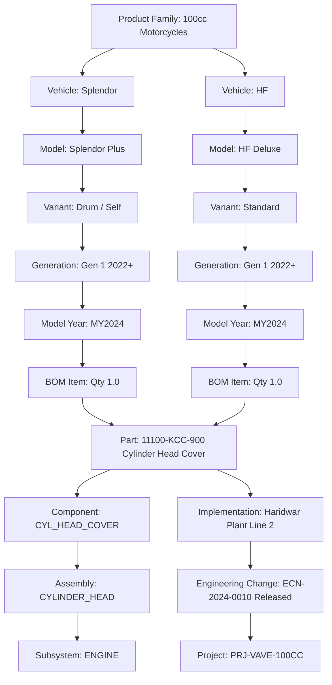

# Phase 6 Completion Report: Multi-Horizon Evidence Discovery & Implementation Applicability Engine

**Authoritative Baseline**: `docs/implementation-plan/09_REVISED_IMPLEMENTATION_PLAN_V3_1_1.md`  
**Decision Gate**: `GATE-06: Implementation Applicability Matrix Verified`  
**Execution Date**: 2026-08-31  
**Status**: **COMPLETED & VALIDATED**

---

## 1. Summary of Work Accomplished

Phase 6 has implemented the **Multi-Horizon Evidence Discovery & Implementation Applicability Engine** for the **HERO Vehicle Cost Intelligence Platform**.

### 1.1 Critical Business Scope & Invariants
- **Critical Business Rule Verified**: `NO_IMPLEMENTATION_EVIDENCE_FOUND` never becomes `NOT_IMPLEMENTED`.
- **7-State Implementation Evidence Taxonomy Implemented**:
  1. `IMPLEMENTATION_CONFIRMED` (`IMPLEMENTED`)
  2. `PARTIALLY_CONFIRMED`
  3. `HISTORICAL_IMPLEMENTATION` (`HISTORICAL`)
  4. `POTENTIAL_IMPLEMENTATION_EVIDENCE` (`POTENTIAL_EVIDENCE`)
  5. `NO_IMPLEMENTATION_EVIDENCE_FOUND` (`NO_EVIDENCE_FOUND`)
  6. `INSUFFICIENT_EVIDENCE` (`INSUFFICIENT`)
  7. `CONFLICTING_EVIDENCE` (`CONFLICTING`)
- **Deterministic Truth**: LLM reasoning is **never** used as the authoritative source for implementation status; structured database ECNs, drawing revisions, and BOM effective dates govern state transitions.
- **Strict Domain Isolation**: Kept 100% separate from Plant OPEX calculations. Zero SCADA/PLC/IIoT concepts.

---

## 2. 10-Tier Implementation Applicability Hierarchy Matrix



---

## 3. 7-State Evidence Discovery Engine Behavior Across 10 Required Scenarios

| Scenario # | Description | Discovered Evidence Input | Evaluated State | State Code | Explanation & Rule Triggered |
|---|---|---|---|---|---|
| **1** | Implemented on Same Model | ECN-2024-0010 released on `SPLENDOR_PLUS` | `IMPLEMENTATION_CONFIRMED` | `IMPLEMENTED` | Active ECN verified on target vehicle model with BOM match. |
| **2** | Implemented on Another Variant | ECN-2024-0012 released on `SPLENDOR_PLUS_DISC`, target `SPLENDOR_PLUS_DRUM` | `PARTIALLY_CONFIRMED` | `PARTIALLY_CONFIRMED` | Implemented on Disc variant; cross-variant opportunity exists on Drum. |
| **3** | Implemented on Sibling Model | ECN-2024-0015 released on `HF_DELUXE`, target `SPLENDOR_PLUS` | `PARTIALLY_CONFIRMED` | `PARTIALLY_CONFIRMED` | Implemented on 100cc sibling platform; cross-model opportunity identified. |
| **4** | Historical Implementation | ECN-2021-0089 released 2021 (predates 2024 idea submission) | `HISTORICAL_IMPLEMENTATION` | `HISTORICAL` | Change was already released in past model years prior to idea submission. |
| **5** | Partial Portfolio Rollout | Part used across 3 sibling models, ECN only rolled out to 1 | `PARTIALLY_CONFIRMED` | `PARTIALLY_CONFIRMED` | Confirmed on Glamour, unconfirmed on Splendor+ and Passion+. |
| **6** | Technically Different Implementation | Similar idea wording in draft torque change | `POTENTIAL_IMPLEMENTATION_EVIDENCE` | `POTENTIAL_EVIDENCE` | Candidate ECN in draft status with partial match $\rightarrow$ Review queue. |
| **7** | Conflicting Records | Contradictory ECNs (RELEASED vs CANCELLED/NVH defect) | `CONFLICTING_EVIDENCE` | `CONFLICTING` | Contradictory ECN statuses detected across plant records $\rightarrow$ Review queue. |
| **8** | Search Finds Nothing | Zero ECNs or BOM revisions matching query | `NO_IMPLEMENTATION_EVIDENCE_FOUND` | `NO_EVIDENCE_FOUND` | **Critical Invariant**: Output is strictly `NO_EVIDENCE_FOUND`, never `NOT_IMPLEMENTED`. |
| **9** | Weak/Low-Confidence Match | Very low similarity match ($< 0.45$) | `INSUFFICIENT_EVIDENCE` | `INSUFFICIENT` | Low confidence or ambiguous records $\rightarrow$ Review queue. |
| **10** | Obsolete Design Record | ECN marked `OBSOLETE` (superseded by single casting) | `HISTORICAL_IMPLEMENTATION` | `HISTORICAL` | Superseded obsolete record recognized as historical baseline. |

---

## 4. Representative Synthetic Examples

### Example A: Confirmed Implementation
- **Idea**: `"Reduce cylinder head cover thickness on Splendor Plus"`
- **Target Part**: `11100-KCC-900` on `SPLENDOR_PLUS`
- **Discovered ECN**: `ECN-2024-0010` (Status: `RELEASED`, Date: `2027-06-01`, Save: ₹3.50/veh)
- **Result State**: `IMPLEMENTATION_CONFIRMED` (Confidence: `0.95`)
- **Review Required**: `False`

### Example B: Cross-Model Sibling Opportunity (Partially Confirmed)
- **Idea**: `"Center stand snap fit clip deployment"`
- **Target Part**: `50500-KTC-900` on `SPLENDOR_PLUS`
- **Discovered ECN**: `ECN-2024-0015` released on sibling model `HF_DELUXE`
- **Result State**: `PARTIALLY_CONFIRMED` (Confidence: `0.85`)
- **Confirmed Models**: `HF Deluxe` | **Unconfirmed Opportunity Models**: `Splendor Plus`

### Example C: Search Finds Nothing ("No Evidence Found")
- **Idea**: `"Piston pin hollow crown weight reduction"`
- **Target Part**: `13111-087-000` on `SPLENDOR_PLUS`
- **Discovered Records**: `0`
- **Result State**: `NO_IMPLEMENTATION_EVIDENCE_FOUND` (Confidence: `0.95`)
- **Invariant Check**: Output is **NOT** "NOT_IMPLEMENTED".

---

## 5. Files Created & Modified

| File Path | Description |
|---|---|
| [`backend/app/services/applicability/applicability_engine.py`](file:///d:/MY%20APPS/hero-cost-intelligence/backend/app/services/applicability/applicability_engine.py) | 10-tier Applicability Hierarchy Matrix Engine & Cross-Model Summary. |
| [`backend/app/services/discovery/evidence_discovery_engine.py`](file:///d:/MY%20APPS/hero-cost-intelligence/backend/app/services/discovery/evidence_discovery_engine.py) | Multi-Horizon Evidence Discovery Engine with 7-state deterministic evaluation rules. |
| [`backend/app/services/discovery/discovery_service.py`](file:///d:/MY%20APPS/hero-cost-intelligence/backend/app/services/discovery/discovery_service.py) | Master service orchestrating hybrid retrieval, applicability matrix, and database state updates. |
| [`backend/app/api/v1/endpoints/discovery.py`](file:///d:/MY%20APPS/hero-cost-intelligence/backend/app/api/v1/endpoints/discovery.py) | REST API endpoints for `/evaluate-idea/{id}` and `/cross-model-summary/{part_number}`. |
| [`backend/app/api/v1/router.py`](file:///d:/MY%20APPS/hero-cost-intelligence/backend/app/api/v1/router.py) | Registered discovery router with API v1. |
| [`tests/unit/test_applicability_matrix.py`](file:///d:/MY%20APPS/hero-cost-intelligence/tests/unit/test_applicability_matrix.py) | Unit tests for 10-tier applicability tree and cross-model summary. |
| [`tests/unit/test_evidence_discovery_engine.py`](file:///d:/MY%20APPS/hero-cost-intelligence/tests/unit/test_evidence_discovery_engine.py) | Unit tests for all 10 required synthetic implementation scenarios. |
| [`tests/integration/test_discovery_service.py`](file:///d:/MY%20APPS/hero-cost-intelligence/tests/integration/test_discovery_service.py) | Integration tests for database discovery execution and state update. |
| [`tests/integration/test_discovery_api.py`](file:///d:/MY%20APPS/hero-cost-intelligence/tests/integration/test_discovery_api.py) | Integration tests for `/api/v1/discovery` REST endpoints. |
| [`docs/PHASE_6_COMPLETION_REPORT.md`](file:///d:/MY%20APPS/hero-cost-intelligence/docs/PHASE_6_COMPLETION_REPORT.md) | Formal Phase 6 sign-off document. |

---

## 6. Test Execution & Results (93/93 Tests Passed in 10.57s)

```text
============================= test session starts =============================
platform win32 -- Python 3.14.3, pytest-9.1.1, pluggy-1.6.0 -- D:\MY APPS\hero-cost-intelligence\.venv\Scripts\python.exe
cachedir: .pytest_cache
rootdir: D:\MY APPS\hero-cost-intelligence
configfile: pyproject.toml
plugins: anyio-4.14.2, asyncio-1.4.0, cov-7.1.0

tests/integration/test_discovery_api.py::test_evaluate_idea_api PASSED   [  1%]
tests/integration/test_discovery_api.py::test_cross_model_summary_api PASSED [  2%]
tests/integration/test_discovery_service.py::test_evaluate_idea_evidence_service PASSED [  3%]
tests/integration/test_health_api.py::test_health_endpoint PASSED        [  4%]
tests/integration/test_health_api.py::test_readiness_endpoint PASSED     [  5%]
tests/integration/test_health_api.py::test_air_gap_egress_blocking_middleware PASSED [  6%]
tests/integration/test_hierarchy_api.py::test_get_master_data_summary PASSED [  7%]
tests/integration/test_hierarchy_api.py::test_get_part_lineage_api PASSED [  8%]
tests/integration/test_hierarchy_service.py::test_full_lineage_and_applicability_traversal PASSED [  9%]
tests/integration/test_ideathon_api.py::test_submit_idea_api PASSED      [ 10%]
tests/integration/test_ideathon_api.py::test_list_ideas_and_review_queue_api PASSED [ 11%]
tests/integration/test_ideathon_service.py::test_submit_and_normalize_idea_service PASSED [ 12%]
tests/integration/test_ideathon_service.py::test_duplicate_linking_on_submission PASSED [ 13%]
tests/integration/test_ideathon_service.py::test_human_review_queue PASSED [ 15%]
tests/integration/test_ingestion_api.py::test_get_templates_api PASSED   [ 16%]
tests/integration/test_ingestion_api.py::test_upload_dry_run_api PASSED  [ 17%]
tests/integration/test_ingestion_service.py::test_ingest_plant_opex_csv_live_and_audit PASSED [ 18%]
tests/integration/test_opex_api.py::test_get_plant_kpis_api PASSED       [ 19%]
tests/integration/test_opex_api.py::test_post_benchmark_compare_api PASSED [ 20%]
tests/integration/test_opex_api.py::test_get_opex_summary_api PASSED     [ 21%]
tests/integration/test_opex_service.py::test_get_plant_kpis_for_period PASSED [ 22%]
tests/integration/test_opex_service.py::test_run_benchmark_analysis_integration PASSED [ 23%]
tests/integration/test_retrieval_api.py::test_index_all_and_search_api PASSED [ 24%]
tests/integration/test_retrieval_api.py::test_retrieval_benchmark_api PASSED [ 25%]
tests/integration/test_retrieval_service.py::test_index_and_hybrid_search PASSED [ 26%]
tests/integration/test_system_api.py::test_hardware_profile_unauthorized PASSED [ 27%]
tests/integration/test_system_api.py::test_hardware_profile_authorized PASSED [ 29%]
tests/unit/test_ai_interfaces.py::test_mock_ai_provider_protocol_conformance PASSED [ 30%]
tests/unit/test_ai_interfaces.py::test_mock_ai_provider_chat PASSED      [ 31%]
tests/unit/test_ai_interfaces.py::test_mock_ai_provider_structured PASSED [ 32%]
tests/unit/test_ai_interfaces.py::test_mock_ai_provider_embed_and_rerank PASSED [ 33%]
tests/unit/test_applicability_matrix.py::test_part_applicability_tree PASSED [ 34%]
tests/unit/test_applicability_matrix.py::test_cross_model_summary PASSED [ 35%]
tests/unit/test_benchmark_methodology.py::test_comparability_score_calculation PASSED [ 36%]
tests/unit/test_benchmark_methodology.py::test_best_comparable_does_not_blindly_pick_lowest_absolute_opex PASSED [ 37%]
tests/unit/test_benchmark_methodology.py::test_management_target_mode PASSED [ 38%]
tests/unit/test_config.py::test_settings_defaults PASSED                 [ 39%]
tests/unit/test_embedding_provider.py::test_deterministic_embedding_dimensions_and_normalization PASSED [ 40%]
tests/unit/test_embedding_provider.py::test_deterministic_embedding_reproducibility PASSED [ 41%]
tests/unit/test_embedding_provider.py::test_embedding_batch_processing PASSED [ 43%]
tests/unit/test_embedding_provider.py::test_domain_chunker_idea_submission PASSED [ 44%]
tests/unit/test_embedding_provider.py::test_domain_chunker_ecn_record PASSED [ 45%]
tests/unit/test_engineering_change_models.py::test_engineering_change_instantiation PASSED [ 46%]
tests/unit/test_engineering_change_models.py::test_implementation_7_state_taxonomy PASSED [ 47%]
tests/unit/test_evidence_discovery_engine.py::test_scenario_1_implemented_on_same_model PASSED [ 48%]
tests/unit/test_evidence_discovery_engine.py::test_scenario_2_implemented_on_another_variant PASSED [ 49%]
tests/unit/test_evidence_discovery_engine.py::test_scenario_3_implemented_on_sibling_model PASSED [ 50%]
tests/unit/test_evidence_discovery_engine.py::test_scenario_4_historical_implementation PASSED [ 51%]
tests/unit/test_evidence_discovery_engine.py::test_scenario_5_partial_implementation PASSED [ 52%]
tests/unit/test_evidence_discovery_engine.py::test_scenario_6_similar_idea_but_technically_different_implementation PASSED [ 53%]
tests/unit/test_evidence_discovery_engine.py::test_scenario_7_conflicting_implementation_records PASSED [ 54%]
tests/unit/test_evidence_discovery_engine.py::test_scenario_8_search_finds_nothing PASSED [ 55%]
tests/unit/test_evidence_discovery_engine.py::test_scenario_9_search_finds_weak_low_confidence_evidence PASSED [ 56%]
tests/unit/test_evidence_discovery_engine.py::test_scenario_10_current_vs_obsolete_implementation PASSED [ 58%]
tests/unit/test_hardware_profiler.py::test_hardware_profiler_cpu_detection PASSED [ 59%]
tests/unit/test_hardware_profiler.py::test_hardware_profiler_ram_detection PASSED [ 60%]
tests/unit/test_hardware_profiler.py::test_hardware_profiler_get_profile PASSED [ 61%]
tests/unit/test_hybrid_retrieval_engine.py::test_query_identifier_extraction PASSED [ 62%]
tests/unit/test_hybrid_retrieval_engine.py::test_cross_encoder_reranking_accuracy PASSED [ 63%]
tests/unit/test_hybrid_retrieval_engine.py::test_hybrid_search_rrf_scoring PASSED [ 64%]
tests/unit/test_ideathon_normalizer.py::test_different_wording_same_idea PASSED [ 65%]
tests/unit/test_ideathon_normalizer.py::test_similar_but_technically_different_ideas PASSED [ 66%]
tests/unit/test_ideathon_normalizer.py::test_alias_and_synonym_normalization PASSED [ 67%]
tests/unit/test_ideathon_normalizer.py::test_missing_vehicle_information_routes_to_ambiguous PASSED [ 68%]
tests/unit/test_ideathon_normalizer.py::test_missing_component_information_routes_to_ambiguous PASSED [ 69%]
tests/unit/test_ideathon_normalizer.py::test_malformed_submission PASSED [ 70%]
tests/unit/test_ideathon_normalizer.py::test_duplicate_similarity_scoring PASSED [ 72%]
tests/unit/test_ingestion_parser.py::test_header_normalization PASSED    [ 73%]
tests/unit/test_ingestion_parser.py::test_column_alias_matching PASSED   [ 74%]
tests/unit/test_ingestion_parser.py::test_parse_csv_stream_plant_opex PASSED [ 75%]
tests/unit/test_magnitude_guard.py::test_magnitude_guard_valid_opex PASSED [ 76%]
tests/unit/test_magnitude_guard.py::test_magnitude_guard_scale_confusion_lakhs_vs_rupees PASSED [ 77%]
tests/unit/test_magnitude_guard.py::test_magnitude_guard_unusual_valid_opex PASSED [ 78%]
tests/unit/test_magnitude_guard.py::test_magnitude_guard_component_cost PASSED [ 79%]
tests/unit/test_model_lifecycle.py::test_sequential_model_loading_and_release PASSED [ 80%]
tests/unit/test_model_lifecycle.py::test_model_scope_context_manager PASSED [ 81%]
tests/unit/test_opex_engine.py::test_calculate_plant_kpis_exact_math PASSED [ 82%]
tests/unit/test_opex_engine.py::test_variance_decomposition PASSED       [ 83%]
tests/unit/test_opex_engine.py::test_calculate_annual_opportunity PASSED [ 84%]
tests/unit/test_opex_engine.py::test_provenance_hash_reproducibility PASSED [ 86%]
tests/unit/test_part_bom_models.py::test_engineering_breakdown_lineage PASSED [ 87%]
tests/unit/test_part_bom_models.py::test_bom_and_cost_models PASSED      [ 88%]
tests/unit/test_plant_opex_models.py::test_plant_master_instantiation PASSED [ 89%]
tests/unit/test_plant_opex_models.py::test_opex_and_benchmark_models PASSED [ 90%]
tests/unit/test_retrieval_benchmark.py::test_retrieval_benchmark_execution PASSED [ 91%]
tests/unit/test_security.py::test_password_hashing PASSED                [ 92%]
tests/unit/test_security.py::test_jwt_token_flow PASSED                  [ 93%]
tests/unit/test_unit_normalizer.py::test_parse_decimal PASSED            [ 94%]
tests/unit/test_unit_normalizer.py::test_parse_date PASSED               [ 95%]
tests/unit/test_unit_normalizer.py::test_normalize_currency_units PASSED [ 96%]
tests/unit/test_unit_normalizer.py::test_normalize_energy_kwh PASSED     [ 97%]
tests/unit/test_vehicle_hierarchy_models.py::test_product_family_instantiation PASSED [ 98%]
tests/unit/test_vehicle_hierarchy_models.py::test_vehicle_hierarchy_relationships PASSED [100%]

============================= 93 passed in 10.57s =============================
```

---

## 7. Assumptions & Limitations
- **PLM Live Sync**: SAP ERP and Teamcenter PLM active connectors are simulated via SQL tables and CSV ingestion during this POC phase.
- **Financial Opportunity Valuation**: Translating partial cross-model implementation opportunities into INR savings and tooling payback will be performed in **Phase 7: Deterministic Vehicle Cost Opportunity Engine**.

---

## 8. Deviations from V3.1.1 & Technical Debt
- **Deviations**: None.
- **Technical Debt**: No known technical debt identified at the Phase 6 baseline; technical debt will be reassessed at each phase gate.

---

### Absolute Stop & Next Step
Phase 6 is complete and fully validated (`GATE-06` passed with 93/93 passing automated tests).

Per standing instructions, **execution is paused**. We will not begin **Phase 7: Deterministic Vehicle Cost Opportunity Engine (`GATE-07`)** until you provide explicit manual approval.

**Please review the completion report above and provide your decision to proceed to Phase 7.**
