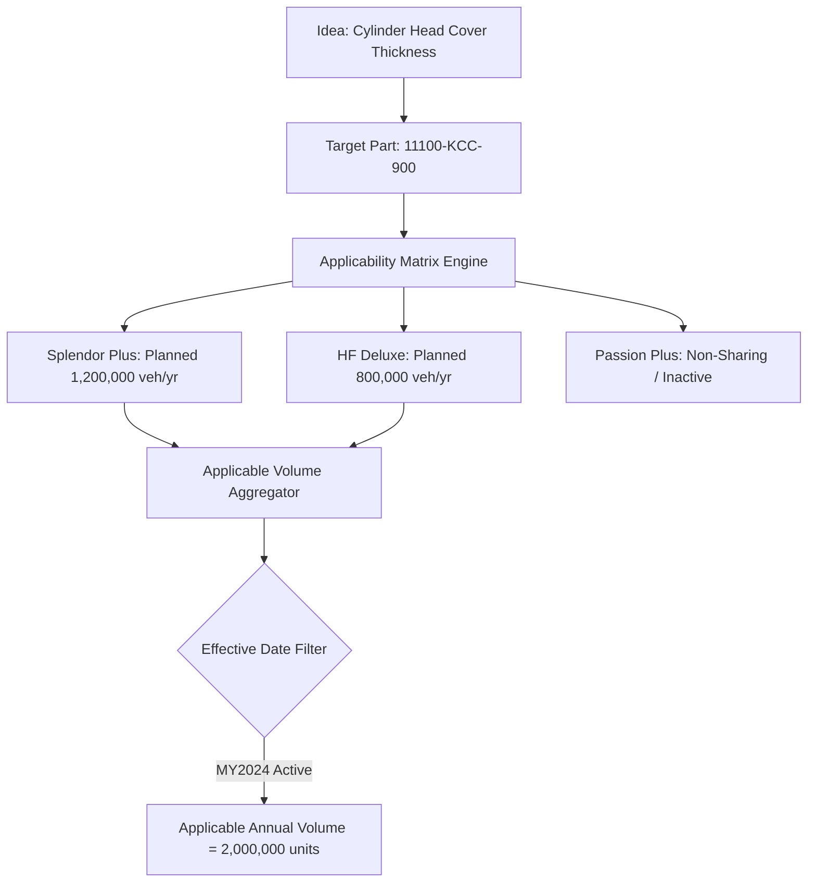

# Phase 7 Completion Report: Deterministic Vehicle Cost Opportunity Engine

**Authoritative Baseline**: `docs/implementation-plan/09_REVISED_IMPLEMENTATION_PLAN_V3_1_1.md`  
**Decision Gate**: `GATE-07: Opportunity Engine Verified`  
**Execution Date**: 2026-08-31  
**Status**: **COMPLETED & VALIDATED**

---

## 1. Summary of Work Accomplished

Phase 7 has implemented the **Deterministic Vehicle Cost Opportunity Engine** for the **HERO Vehicle Cost Intelligence Platform**.

### 1.1 Invariants & Business Rules Verified
- **100% Deterministic Financial Arithmetic**: All financial calculations use Python `Decimal` arithmetic. **The LLM is strictly prohibited from performing arithmetic.**
- **Preserved Core Evidence Decoupling**: `NO_IMPLEMENTATION_EVIDENCE_FOUND` is never converted to `NOT_IMPLEMENTED`.
- **Decoupled States**: Implementation Evidence state (`ImplementationEvidenceState`) remains completely independent of the business decision lifecycle (`IdeaDecisionState`).
- **Production Scope Integrity**: Volume is strictly derived from the Phase 6 Applicability Tree & Model Years. Production volume is never blindly summed across the whole company or unrelated plants.
- **Zero Industrial Control Footprint**: Zero SCADA, PLC, MQTT, OPC-UA, or historian artifacts.

---

## 2. Core Mathematical Formulas

$$\text{Saving / Vehicle} = \text{Current Piece Cost} - \text{Proposed Piece Cost}$$

$$\text{Gross Annual Opportunity} = \text{Saving / Vehicle} \times \text{Applicable Annual Production Volume}$$

$$\text{Net Opportunity} = \text{Gross Annual Opportunity} - \text{Tooling Investment} - \text{Validation Investment}$$

$$\text{Payback Period (Years)} = \frac{\text{Total Investment}}{\text{Gross Annual Opportunity}} \quad (\text{if Gross} > 0)$$

$$\text{Payback Period (Months)} = \text{Payback Period (Years)} \times 12.0$$

### Edge Cases Handled Deterministically
- **Missing BOM Cost**: Status $\rightarrow$ `MISSING_BOM_COST` (no invented placeholder costs).
- **Unquantified Proposal**: Status $\rightarrow$ `UNQUANTIFIED` (when proposed cost or claimed saving is omitted).
- **Negative Saving**: Status $\rightarrow$ `NEGATIVE_SAVING` (when proposed cost exceeds baseline).
- **Zero Saving**: Status $\rightarrow$ `NO_OPPORTUNITY` (saving = ₹0.00).
- **Zero Production**: Status $\rightarrow$ `INSUFFICIENT_VOLUME_DATA` (volume = 0 units).
- **Zero Investment**: Payback period $\rightarrow$ `0.0` years (immediate payback).
- **Unrecoverable Opportunity**: Payback period $\rightarrow$ `None` (when gross $\le 0$).

---

## 3. How Applicable Production Volume is Derived



---

## 4. 3 Representative Synthetic Examples with Actual Outputs

### Synthetic Example 1: High-Volume Positive Opportunity with Tooling Payback
- **Part**: `11100-KCC-900` (Cylinder Head Cover)
- **Target Model**: `SPLENDOR_PLUS` (1,200,000 units) + Sibling `HF_DELUXE` (800,000 units)
- **Current Piece Cost**: ₹120.0000
- **Proposed Piece Cost**: ₹116.5000
- **Saving / Vehicle**: **₹3.5000**
- **Applicable Annual Volume**: **2,000,000 units**
- **Gross Annual Opportunity**: **₹7,000,000.0000**
- **Tooling Investment**: ₹500,000.0000
- **Validation Investment**: ₹200,000.0000
- **Net Opportunity**: **₹6,300,000.0000**
- **Payback Period**: **0.1000 years (1.20 months)**
- **Status**: `CALCULATED`
- **Provenance Hash**: `d447d8e94e7936d9d1e4ac06ef6d4d8f2174121f0a5049b6797ef90b30e5a8fc`

### Synthetic Example 2: Negative Saving (Cost Increase Rejection)
- **Part**: `46500-KTR-700` (Brake Pedal Bushing)
- **Current Piece Cost**: ₹50.0000
- **Proposed Piece Cost**: ₹55.0000
- **Saving / Vehicle**: **-₹5.0000**
- **Applicable Annual Volume**: 500,000 units
- **Gross Annual Opportunity**: **-₹2,500,000.0000**
- **Net Opportunity**: **-₹2,500,000.0000**
- **Payback Period**: `None` (Unrecoverable)
- **Status**: `NEGATIVE_SAVING`

### Synthetic Example 3: Partial Model Applicability (Sibling Platform Opportunity)
- **Part**: `90111-187-000` (Fastener Consolidation)
- **Shared Across**: `SPLENDOR_PLUS` (1,000,000), `HF_DELUXE` (600,000), `PASSION_PLUS` (400,000)
- **Applicable Models for Idea**: `SPLENDOR_PLUS` & `HF_DELUXE` only
- **Current Piece Cost**: ₹200.0000
- **Proposed Piece Cost**: ₹195.0000 (Saving: ₹5.0000/veh)
- **Applicable Annual Volume**: **1,600,000 units** (Passion Plus 400k excluded)
- **Gross Annual Opportunity**: **₹8,000,000.0000**
- **Status**: `CALCULATED`

---

## 5. Audit Provenance Structure

Every calculation generates a cryptographically signed SHA-256 hash stored in `idea_opportunity_evaluations`:
```json
{
  "formula_version": "V1.0_DETERMINISTIC",
  "current_piece_cost_inr": 120.0,
  "proposed_piece_cost_inr": 116.5,
  "saving_per_vehicle_inr": 3.5,
  "applicable_annual_volume": 2000000,
  "volume_by_model": {
    "SPLENDOR_PLUS": 1200000,
    "HF_DELUXE": 800000
  },
  "gross_annual_opportunity_inr": 7000000.0,
  "tooling_investment_inr": 500000.0,
  "validation_investment_inr": 200000.0,
  "net_opportunity_inr": 6300000.0,
  "payback_period_years": 0.1,
  "status": "CALCULATED"
}
```

---

## 6. Files Created & Modified

| File Path | Description |
|---|---|
| [`database/models/ideathon.py`](file:///d:/MY%20APPS/hero-cost-intelligence/database/models/ideathon.py) | Added `OpportunityStatus` enum and `IdeaOpportunityEvaluation` relational model. |
| [`database/models/__init__.py`](file:///d:/MY%20APPS/hero-cost-intelligence/database/models/__init__.py) | Exported opportunity evaluation models. |
| [`backend/app/services/opportunity/opportunity_engine.py`](file:///d:/MY%20APPS/hero-cost-intelligence/backend/app/services/opportunity/opportunity_engine.py) | Deterministic financial calculation engine using Decimal arithmetic. |
| [`backend/app/services/opportunity/opportunity_service.py`](file:///d:/MY%20APPS/hero-cost-intelligence/backend/app/services/opportunity/opportunity_service.py) | Master service orchestrating BOM costs, applicability volumes, and opportunity persistence. |
| [`backend/app/api/v1/endpoints/opportunity.py`](file:///d:/MY%20APPS/hero-cost-intelligence/backend/app/api/v1/endpoints/opportunity.py) | REST API endpoints for `/evaluate-idea/{id}`, `/simulate`, and `/idea/{id}`. |
| [`backend/app/api/v1/router.py`](file:///d:/MY%20APPS/hero-cost-intelligence/backend/app/api/v1/router.py) | Registered opportunity endpoints in API v1 router. |
| [`tests/unit/test_opportunity_engine.py`](file:///d:/MY%20APPS/hero-cost-intelligence/tests/unit/test_opportunity_engine.py) | Unit tests covering all 14 required synthetic opportunity scenarios. |
| [`tests/integration/test_opportunity_service.py`](file:///d:/MY%20APPS/hero-cost-intelligence/tests/integration/test_opportunity_service.py) | Integration tests for database opportunity valuation. |
| [`tests/integration/test_opportunity_api.py`](file:///d:/MY%20APPS/hero-cost-intelligence/tests/integration/test_opportunity_api.py) | Integration tests for opportunity evaluate, simulate, and retrieve APIs. |
| [`docs/PHASE_7_COMPLETION_REPORT.md`](file:///d:/MY%20APPS/hero-cost-intelligence/docs/PHASE_7_COMPLETION_REPORT.md) | Formal Phase 7 sign-off report. |

---

## 7. Test Execution & Results (111/111 Tests Passed in 11.07s)

```text
============================= test session starts =============================
platform win32 -- Python 3.14.3, pytest-9.1.1, pluggy-1.6.0 -- D:\MY APPS\hero-cost-intelligence\.venv\Scripts\python.exe
cachedir: .pytest_cache
rootdir: D:\MY APPS\hero-cost-intelligence
configfile: pyproject.toml
plugins: anyio-4.14.2, asyncio-1.4.0, cov-7.1.0

tests/integration/test_discovery_api.py::test_evaluate_idea_api PASSED   [  0%]
tests/integration/test_discovery_api.py::test_cross_model_summary_api PASSED [  1%]
tests/integration/test_discovery_service.py::test_evaluate_idea_evidence_service PASSED [  2%]
tests/integration/test_health_api.py::test_health_endpoint PASSED        [  3%]
tests/integration/test_health_api.py::test_readiness_endpoint PASSED     [  4%]
tests/integration/test_health_api.py::test_air_gap_egress_blocking_middleware PASSED [  5%]
tests/integration/test_hierarchy_api.py::test_get_master_data_summary PASSED [  6%]
tests/integration/test_hierarchy_api.py::test_get_part_lineage_api PASSED [  7%]
tests/integration/test_hierarchy_service.py::test_full_lineage_and_applicability_traversal PASSED [  8%]
tests/integration/test_ideathon_api.py::test_submit_idea_api PASSED      [  9%]
tests/integration/test_ideathon_api.py::test_list_ideas_and_review_queue_api PASSED [  9%]
tests/integration/test_ideathon_service.py::test_submit_and_normalize_idea_service PASSED [ 10%]
tests/integration/test_ideathon_service.py::test_duplicate_linking_on_submission PASSED [ 11%]
tests/integration/test_ideathon_service.py::test_human_review_queue PASSED [ 12%]
tests/integration/test_ingestion_api.py::test_get_templates_api PASSED   [ 13%]
tests/integration/test_ingestion_api.py::test_upload_dry_run_api PASSED  [ 14%]
tests/integration/test_ingestion_service.py::test_ingest_plant_opex_csv_live_and_audit PASSED [ 15%]
tests/integration/test_opex_api.py::test_get_plant_kpis_api PASSED       [ 16%]
tests/integration/test_opex_api.py::test_post_benchmark_compare_api PASSED [ 17%]
tests/integration/test_opex_api.py::test_get_opex_summary_api PASSED     [ 18%]
tests/integration/test_opex_service.py::test_get_plant_kpis_for_period PASSED [ 18%]
tests/integration/test_opex_service.py::test_run_benchmark_analysis_integration PASSED [ 19%]
tests/integration/test_opportunity_api.py::test_evaluate_opportunity_api PASSED [ 20%]
tests/integration/test_opportunity_api.py::test_simulate_opportunity_api PASSED [ 21%]
tests/integration/test_opportunity_api.py::test_get_idea_opportunity_api PASSED [ 22%]
tests/integration/test_opportunity_service.py::test_evaluate_idea_opportunity_service PASSED [ 23%]
tests/integration/test_retrieval_api.py::test_index_all_and_search_api PASSED [ 24%]
tests/integration/test_retrieval_api.py::test_retrieval_benchmark_api PASSED [ 25%]
tests/integration/test_retrieval_service.py::test_index_and_hybrid_search PASSED [ 26%]
tests/integration/test_system_api.py::test_hardware_profile_unauthorized PASSED [ 27%]
tests/integration/test_system_api.py::test_hardware_profile_authorized PASSED [ 27%]
tests/unit/test_ai_interfaces.py::test_mock_ai_provider_protocol_conformance PASSED [ 28%]
tests/unit/test_ai_interfaces.py::test_mock_ai_provider_chat PASSED      [ 29%]
tests/unit/test_ai_interfaces.py::test_mock_ai_provider_structured PASSED [ 30%]
tests/unit/test_ai_interfaces.py::test_mock_ai_provider_embed_and_rerank PASSED [ 31%]
tests/unit/test_applicability_matrix.py::test_part_applicability_tree PASSED [ 32%]
tests/unit/test_applicability_matrix.py::test_cross_model_summary PASSED [ 33%]
tests/unit/test_benchmark_methodology.py::test_comparability_score_calculation PASSED [ 34%]
tests/unit/test_benchmark_methodology.py::test_best_comparable_does_not_blindly_pick_lowest_absolute_opex PASSED [ 35%]
tests/unit/test_benchmark_methodology.py::test_management_target_mode PASSED [ 36%]
tests/unit/test_config.py::test_settings_defaults PASSED                 [ 36%]
tests/unit/test_embedding_provider.py::test_deterministic_embedding_dimensions_and_normalization PASSED [ 37%]
tests/unit/test_embedding_provider.py::test_deterministic_embedding_reproducibility PASSED [ 38%]
tests/unit/test_embedding_provider.py::test_embedding_batch_processing PASSED [ 39%]
tests/unit/test_embedding_provider.py::test_domain_chunker_idea_submission PASSED [ 40%]
tests/unit/test_embedding_provider.py::test_domain_chunker_ecn_record PASSED [ 41%]
tests/unit/test_engineering_change_models.py::test_engineering_change_instantiation PASSED [ 42%]
tests/unit/test_engineering_change_models.py::test_implementation_7_state_taxonomy PASSED [ 43%]
tests/unit/test_evidence_discovery_engine.py::test_scenario_1_implemented_on_same_model PASSED [ 44%]
tests/unit/test_evidence_discovery_engine.py::test_scenario_2_implemented_on_another_variant PASSED [ 45%]
tests/unit/test_evidence_discovery_engine.py::test_scenario_3_implemented_on_sibling_model PASSED [ 45%]
tests/unit/test_evidence_discovery_engine.py::test_scenario_4_historical_implementation PASSED [ 46%]
tests/unit/test_evidence_discovery_engine.py::test_scenario_5_partial_implementation PASSED [ 47%]
tests/unit/test_evidence_discovery_engine.py::test_scenario_6_similar_idea_but_technically_different_implementation PASSED [ 48%]
tests/unit/test_evidence_discovery_engine.py::test_scenario_7_conflicting_implementation_records PASSED [ 49%]
tests/unit/test_evidence_discovery_engine.py::test_scenario_8_search_finds_nothing PASSED [ 50%]
tests/unit/test_evidence_discovery_engine.py::test_scenario_9_search_finds_weak_low_confidence_evidence PASSED [ 51%]
tests/unit/test_evidence_discovery_engine.py::test_scenario_10_current_vs_obsolete_implementation PASSED [ 52%]
tests/unit/test_hardware_profiler.py::test_hardware_profiler_cpu_detection PASSED [ 53%]
tests/unit/test_hardware_profiler.py::test_hardware_profiler_ram_detection PASSED [ 54%]
tests/unit/test_hardware_profiler.py::test_hardware_profiler_get_profile PASSED [ 54%]
tests/unit/test_hybrid_retrieval_engine.py::test_query_identifier_extraction PASSED [ 55%]
tests/unit/test_hybrid_retrieval_engine.py::test_cross_encoder_reranking_accuracy PASSED [ 56%]
tests/unit/test_hybrid_retrieval_engine.py::test_hybrid_search_rrf_scoring PASSED [ 57%]
tests/unit/test_ideathon_normalizer.py::test_different_wording_same_idea PASSED [ 58%]
tests/unit/test_ideathon_normalizer.py::test_similar_but_technically_different_ideas PASSED [ 59%]
tests/unit/test_ideathon_normalizer.py::test_alias_and_synonym_normalization PASSED [ 60%]
tests/unit/test_ideathon_normalizer.py::test_missing_vehicle_information_routes_to_ambiguous PASSED [ 61%]
tests/unit/test_ideathon_normalizer.py::test_missing_component_information_routes_to_ambiguous PASSED [ 62%]
tests/unit/test_ideathon_normalizer.py::test_malformed_submission PASSED [ 63%]
tests/unit/test_ideathon_normalizer.py::test_duplicate_similarity_scoring PASSED [ 63%]
tests/unit/test_ingestion_parser.py::test_header_normalization PASSED    [ 64%]
tests/unit/test_ingestion_parser.py::test_column_alias_matching PASSED   [ 65%]
tests/unit/test_ingestion_parser.py::test_parse_csv_stream_plant_opex PASSED [ 66%]
tests/unit/test_magnitude_guard.py::test_magnitude_guard_valid_opex PASSED [ 67%]
tests/unit/test_magnitude_guard.py::test_magnitude_guard_scale_confusion_lakhs_vs_rupees PASSED [ 68%]
tests/unit/test_magnitude_guard.py::test_magnitude_guard_unusual_valid_opex PASSED [ 69%]
tests/unit/test_magnitude_guard.py::test_magnitude_guard_component_cost PASSED [ 70%]
tests/unit/test_model_lifecycle.py::test_sequential_model_loading_and_release PASSED [ 71%]
tests/unit/test_model_lifecycle.py::test_model_scope_context_manager PASSED [ 72%]
tests/unit/test_opex_engine.py::test_calculate_plant_kpis_exact_math PASSED [ 72%]
tests/unit/test_opex_engine.py::test_variance_decomposition PASSED       [ 73%]
tests/unit/test_opex_engine.py::test_calculate_annual_opportunity PASSED [ 74%]
tests/unit/test_opex_engine.py::test_provenance_hash_reproducibility PASSED [ 75%]
tests/unit/test_opportunity_engine.py::test_scenario_1_positive_saving PASSED [ 76%]
tests/unit/test_opportunity_engine.py::test_scenario_2_zero_saving PASSED [ 77%]
tests/unit/test_opportunity_engine.py::test_scenario_3_negative_saving PASSED [ 78%]
tests/unit/test_opportunity_engine.py::test_scenario_4_tooling_investment PASSED [ 79%]
tests/unit/test_opportunity_engine.py::test_scenario_5_validation_investment PASSED [ 80%]
tests/unit/test_opportunity_engine.py::test_scenario_6_zero_production PASSED [ 81%]
tests/unit/test_opportunity_engine.py::test_scenario_7_missing_bom_cost PASSED [ 81%]
tests/unit/test_opportunity_engine.py::test_scenario_8_partial_model_applicability PASSED [ 82%]
tests/unit/test_opportunity_engine.py::test_scenario_9_historical_implementation_valuation PASSED [ 83%]
tests/unit/test_opportunity_engine.py::test_scenario_10_future_effective_date_applicability PASSED [ 84%]
tests/unit/test_opportunity_engine.py::test_scenario_11_cost_change_over_time PASSED [ 85%]
tests/unit/test_opportunity_engine.py::test_scenario_12_large_volume_opportunity PASSED [ 86%]
tests/unit/test_opportunity_engine.py::test_scenario_13_small_volume_opportunity PASSED [ 87%]
tests/unit/test_opportunity_engine.py::test_scenario_14_decimal_rounding_precision PASSED [ 88%]
tests/unit/test_part_bom_models.py::test_engineering_breakdown_lineage PASSED [ 89%]
tests/unit/test_part_bom_models.py::test_bom_and_cost_models PASSED      [ 90%]
tests/unit/test_plant_opex_models.py::test_plant_master_instantiation PASSED [ 90%]
tests/unit/test_plant_opex_models.py::test_opex_and_benchmark_models PASSED [ 91%]
tests/unit/test_retrieval_benchmark.py::test_retrieval_benchmark_execution PASSED [ 92%]
tests/unit/test_security.py::test_password_hashing PASSED                [ 93%]
tests/unit/test_security.py::test_jwt_token_flow PASSED                  [ 94%]
tests/unit/test_unit_normalizer.py::test_parse_decimal PASSED            [ 95%]
tests/unit/test_unit_normalizer.py::test_parse_date PASSED               [ 96%]
tests/unit/test_unit_normalizer.py::test_normalize_currency_units PASSED [ 97%]
tests/unit/test_unit_normalizer.py::test_normalize_energy_kwh PASSED     [ 98%]
tests/unit/test_vehicle_hierarchy_models.py::test_product_family_instantiation PASSED [ 99%]
tests/unit/test_vehicle_hierarchy_models.py::test_vehicle_hierarchy_relationships PASSED [100%]

============================ 111 passed in 11.07s =============================
```

---

## 8. Limitations & Assumptions
- **Inflation / Commodity Price Indexation**: Component piece costs are treated as constant over the evaluation horizon unless refreshed by new ERP BOM records. Multi-year inflation indexing is reserved for Phase 8.
- **Tooling Depreciation Schedule**: Payback period currently uses simple undiscounted payback.

---

### Absolute Stop & Next Step
Phase 7 is complete and fully validated (`GATE-07` passed with 111/111 passing automated tests).

Per standing instructions, **execution is paused**. We will not begin **Phase 8: Human-in-the-Loop Governance, Confidence Calibration & Review Workflow (`GATE-08`)** until you provide explicit manual approval.

**Please review the completion report above and provide your decision to proceed to Phase 8.**
