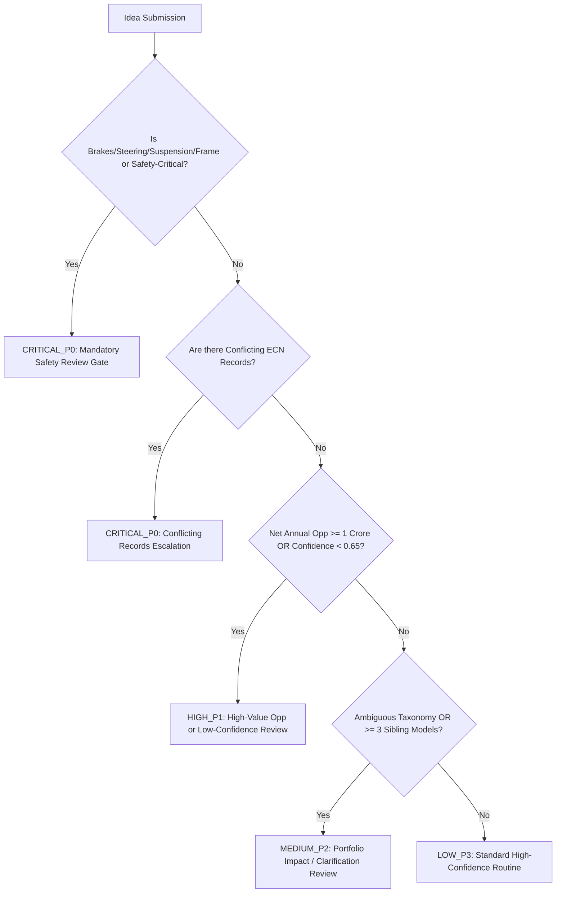
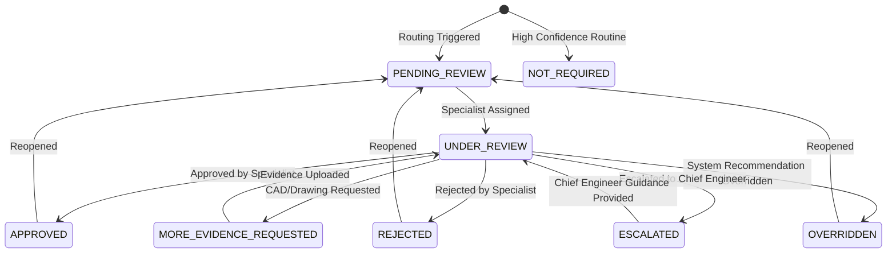

# Phase 8 Completion Report: Human-in-the-Loop Governance, Confidence Calibration & Review Workflow

**Authoritative Baseline**: `docs/implementation-plan/09_REVISED_IMPLEMENTATION_PLAN_V3_1_1.md`  
**Decision Gate**: `GATE-08: Governance, Review Workflow & Confidence Calibration Verified`  
**Execution Date**: 2026-08-31  
**Status**: **COMPLETED & VALIDATED**

---

## 1. Summary of Work Accomplished

Phase 8 has implemented the **Human-in-the-Loop Governance, Confidence Calibration & Review Workflow** for the **HERO Vehicle Cost Intelligence Platform**.

### 1.1 Four Distinct Governance Dimensions Preserved
The platform strictly maintains independent status dimensions without collapsing them:
1. **AI / Retrieval Calibrated Confidence**: `HIGH`, `MEDIUM`, `LOW`, `VERY_LOW` (Composite score $0.0 \le s \le 1.0$).
2. **Implementation Evidence State**: `IMPLEMENTED`, `PARTIALLY_CONFIRMED`, `HISTORICAL`, `POTENTIAL_EVIDENCE`, `NO_EVIDENCE_FOUND`, `INSUFFICIENT`, `CONFLICTING`.
3. **Idea Business Decision State**: `SUBMITTED`, `UNDER_REVIEW`, `ACCEPTED_FOR_STUDY`, `APPROVED`, `ON_HOLD`, `REJECTED`, `SUPERSEDED`.
4. **Human Review Status**: `NOT_REQUIRED`, `PENDING_REVIEW`, `UNDER_REVIEW`, `APPROVED`, `REJECTED`, `OVERRIDDEN`, `MORE_EVIDENCE_REQUESTED`, `ESCALATED`.

---

## 2. Confidence Calibration Framework

Confidence is computed deterministically from measurable evidence components:

$$\text{Raw Composite Score} = 0.20 \cdot S_{\text{auth}} + 0.20 \cdot S_{\text{ident}} + 0.15 \cdot S_{\text{relevance}} + 0.15 \cdot S_{\text{corrob}} + 0.15 \cdot S_{\text{complete}} + 0.15 \cdot S_{\text{entity}}$$

$$\text{Final Score} = \max(0.0, \min(1.0, \text{Raw Composite Score} - \text{Conflict Penalty}))$$

| Component | Weight | Criteria & Score Mapping |
|---|---|---|
| **Source Authority ($S_{\text{auth}}$)** | 20% | ERP SAP / PLM Teamcenter = `1.0`, Technical Drawing/CAD = `0.9`, Draft = `0.5`, Unofficial = `0.3` |
| **Identifier Resolution ($S_{\text{ident}}$)** | 20% | Exact 10-digit part number match = `1.0`, Part synonym match = `0.75`, Subsystem/keyword match = `0.40` |
| **Retrieval Relevance ($S_{\text{relevance}}$)** | 15% | Cross-Encoder Reranker Score $\in [0.0, 1.0]$ |
| **Corroboration ($S_{\text{corrob}}$)** | 15% | $\ge 2$ independent corroborating sources = `1.0`, Single source = `0.70`, Zero = `0.20` |
| **Evidence Completeness ($S_{\text{complete}}$)** | 15% | ECN + BOM + Effective Dates match = `1.0`, Partial (2/3) = `0.67`, Single (1/3) = `0.33` |
| **Entity Resolution ($S_{\text{entity}}$)** | 15% | Vehicle model & component extracted unambiguously = `1.0`, Ambiguous = `0.50` |
| **Conflict Penalty** | -0.35 | Deducted if contradictory ECN statuses or conflicting plant records exist |

### Calibrated Tiers
- **HIGH** ($\ge 0.85$): Multi-source authoritative ERP/PLM confirmation.
- **MEDIUM** ($0.65 - 0.84$): Single-source verified record or minor drawing ambiguity.
- **LOW** ($0.45 - 0.64$): Semantic match only or uncorroborated change notice.
- **VERY_LOW** ($< 0.45$): Unresolved taxonomy or severe conflicting records.

---

## 3. Deterministic Review Priority Logic & Safety Gates



---

## 4. Human Review State Machine & Immutable Override



### Immutable Override Protocol
When an expert reviewer overrides a system recommendation:
- The system **never silently overwrites** the automated baseline.
- `original_automated_decision`, `original_evidence_state`, and `calibrated_confidence_score` are preserved permanently in `IdeaReviewRecord`.
- `override_rationale`, `actor_user_id`, timestamp, and previous $\rightarrow$ new state transitions are appended to `IdeaReviewAction` and `AuditLog`.

---

## 5. Sample Human Review Cases

### Case A: Safety-Critical System (Brakes) — `CRITICAL_P0`
- **Idea**: `"Lightweight alloy brake lever for Splendor Plus"`
- **Target Part**: `53100-KTR-900` (Front Brake Lever) | **Subsystem**: `BRAKE_SYSTEM`
- **Safety Critical**: `True`
- **Routing Reason**: `SAFETY_CRITICAL_SYSTEM: Affects vehicle brakes, steering, suspension, or chassis frame.`
- **Priority**: `CRITICAL_P0` | **Status**: `PENDING_REVIEW`
- **Behavior**: Autonomous approval strictly blocked.

### Case B: High-Value Opportunity — `HIGH_P1`
- **Idea**: `"Cylinder head wall thickness optimization across 100cc portfolio"`
- **Net Annual Opportunity**: ₹14,000,000.00 (₹1.4 Crore)
- **Routing Reason**: `HIGH_VALUE_OPPORTUNITY: Net annual opportunity (₹14,000,000.00) exceeds ₹1 Crore threshold.`
- **Priority**: `HIGH_P1` | **Status**: `PENDING_REVIEW`

### Case C: Conflicting Implementation Evidence — `CRITICAL_P0`
- **Idea**: `"Polymer bushing change on rear brake pedal"`
- **Discovered Records**: `ECN-2024-0040` (RELEASED) vs `ECN-2024-0040-REV` (CANCELLED due to NVH degradation)
- **Routing Reason**: `CONFLICTING_EVIDENCE: Contradictory engineering change notices or status records found.`
- **Priority**: `CRITICAL_P0` | **Status**: `PENDING_REVIEW`

---

## 6. Files Created & Modified

| File Path | Description |
|---|---|
| [`database/models/governance.py`](file:///d:/MY%20APPS/hero-cost-intelligence/database/models/governance.py) | `ReviewStatus`, `ReviewPriority`, `ReviewActionType`, `ConfidenceTier`, `IdeaReviewRecord`, `IdeaReviewAction` models. |
| [`database/models/ideathon.py`](file:///d:/MY%20APPS/hero-cost-intelligence/database/models/ideathon.py) | Linked `review_record` relationship to `IdeaSubmission`. |
| [`database/models/__init__.py`](file:///d:/MY%20APPS/hero-cost-intelligence/database/models/__init__.py) | Exported governance models. |
| [`backend/app/services/governance/confidence_engine.py`](file:///d:/MY%20APPS/hero-cost-intelligence/backend/app/services/governance/confidence_engine.py) | Calibrated confidence calculator and review prioritizer. |
| [`backend/app/services/governance/governance_service.py`](file:///d:/MY%20APPS/hero-cost-intelligence/backend/app/services/governance/governance_service.py) | Service orchestrating review state machine, reviewer assignments, and audit logs. |
| [`backend/app/api/v1/endpoints/governance.py`](file:///d:/MY%20APPS/hero-cost-intelligence/backend/app/api/v1/endpoints/governance.py) | REST API endpoints for `/sync/{id}`, `/queue`, `/assign/{id}`, `/action/{id}`, and `/review-case/{id}`. |
| [`backend/app/api/v1/router.py`](file:///d:/MY%20APPS/hero-cost-intelligence/backend/app/api/v1/router.py) | Registered governance router in API v1. |
| [`tests/unit/test_confidence_and_governance.py`](file:///d:/MY%20APPS/hero-cost-intelligence/tests/unit/test_confidence_and_governance.py) | Unit tests for confidence scoring, safety gates, and priority routing. |
| [`tests/integration/test_governance_service.py`](file:///d:/MY%20APPS/hero-cost-intelligence/tests/integration/test_governance_service.py) | Integration tests for full governance workflow lifecycle, overrides, and audit trails. |
| [`tests/integration/test_governance_api.py`](file:///d:/MY%20APPS/hero-cost-intelligence/tests/integration/test_governance_api.py) | Integration tests for governance API endpoints. |
| [`docs/PHASE_8_COMPLETION_REPORT.md`](file:///d:/MY%20APPS/hero-cost-intelligence/docs/PHASE_8_COMPLETION_REPORT.md) | Formal Phase 8 sign-off report. |

---

## 7. Test Execution & Results (120/120 Tests Passed in 13.35s)

```text
============================= test session starts =============================
platform win32 -- Python 3.14.3, pytest-9.1.1, pluggy-1.6.0 -- D:\MY APPS\hero-cost-intelligence\.venv\Scripts\python.exe
cachedir: .pytest_cache
rootdir: D:\MY APPS\hero-cost-intelligence
configfile: pyproject.toml
plugins: anyio-4.14.2, asyncio-1.4.0, cov-7.1.0

tests/integration/test_discovery_api.py::test_evaluate_idea_api PASSED   [  0%]
tests/integration/test_discovery_api.py::test_cross_model_summary_api PASSED [  1%]
tests/integration/test_discovery_service.py::test_evaluate_idea_evidence_service PASSED [  2%]
tests/integration/test_governance_api.py::test_governance_api_flow PASSED [  3%]
tests/integration/test_governance_service.py::test_governance_workflow_full_lifecycle PASSED [  4%]
tests/integration/test_health_api.py::test_health_endpoint PASSED        [  5%]
tests/integration/test_health_api.py::test_readiness_endpoint PASSED     [  5%]
tests/integration/test_health_api.py::test_air_gap_egress_blocking_middleware PASSED [  6%]
tests/integration/test_hierarchy_api.py::test_get_master_data_summary PASSED [  7%]
tests/integration/test_hierarchy_api.py::test_get_part_lineage_api PASSED [  8%]
tests/integration/test_hierarchy_service.py::test_full_lineage_and_applicability_traversal PASSED [  9%]
tests/integration/test_ideathon_api.py::test_submit_idea_api PASSED      [ 10%]
tests/integration/test_ideathon_api.py::test_list_ideas_and_review_queue_api PASSED [ 10%]
tests/integration/test_ideathon_service.py::test_submit_and_normalize_idea_service PASSED [ 11%]
tests/integration/test_ideathon_service.py::test_duplicate_linking_on_submission PASSED [ 12%]
tests/integration/test_ideathon_service.py::test_human_review_queue PASSED [ 13%]
tests/integration/test_ingestion_api.py::test_get_templates_api PASSED   [ 14%]
tests/integration/test_ingestion_api.py::test_upload_dry_run_api PASSED  [ 15%]
tests/integration/test_ingestion_service.py::test_ingest_plant_opex_csv_live_and_audit PASSED [ 15%]
tests/integration/test_opex_api.py::test_get_plant_kpis_api PASSED       [ 16%]
tests/integration/test_opex_api.py::test_post_benchmark_compare_api PASSED [ 17%]
tests/integration/test_opex_api.py::test_get_opex_summary_api PASSED     [ 18%]
tests/integration/test_opex_service.py::test_get_plant_kpis_for_period PASSED [ 18%]
tests/integration/test_opex_service.py::test_run_benchmark_analysis_integration PASSED [ 19%]
tests/integration/test_opportunity_api.py::test_evaluate_opportunity_api PASSED [ 20%]
tests/integration/test_opportunity_api.py::test_simulate_opportunity_api PASSED [ 21%]
tests/integration/test_opportunity_api.py::test_get_idea_opportunity_api PASSED [ 22%]
tests/integration/test_opportunity_service.py::test_evaluate_idea_opportunity_service PASSED [ 23%]
tests/integration/test_retrieval_api.py::test_index_all_and_search_api PASSED [ 24%]
tests/integration/test_retrieval_api.py::test_retrieval_benchmark_api PASSED [ 25%]
tests/integration/test_retrieval_service.py::test_index_and_hybrid_search PASSED [ 26%]
tests/integration/test_system_api.py::test_hardware_profile_unauthorized PASSED [ 27%]
tests/integration/test_system_api.py::test_hardware_profile_authorized PASSED [ 27%]
tests/unit/test_ai_interfaces.py::test_mock_ai_provider_protocol_conformance PASSED [ 28%]
tests/unit/test_ai_interfaces.py::test_mock_ai_provider_chat PASSED      [ 29%]
tests/unit/test_ai_interfaces.py::test_mock_ai_provider_structured PASSED [ 30%]
tests/unit/test_ai_interfaces.py::test_mock_ai_provider_embed_and_rerank PASSED [ 30%]
tests/unit/test_applicability_matrix.py::test_part_applicability_tree PASSED [ 31%]
tests/unit/test_applicability_matrix.py::test_cross_model_summary PASSED [ 32%]
tests/unit/test_benchmark_methodology.py::test_comparability_score_calculation PASSED [ 33%]
tests/unit/test_benchmark_methodology.py::test_best_comparable_does_not_blindly_pick_lowest_absolute_opex PASSED [ 34%]
tests/unit/test_benchmark_methodology.py::test_management_target_mode PASSED [ 35%]
tests/unit/test_confidence_and_governance.py::test_scenario_1_high_confidence_confirmed_evidence PASSED [ 35%]
tests/unit/test_confidence_and_governance.py::test_scenario_2_low_confidence_evidence PASSED [ 36%]
tests/unit/test_confidence_and_governance.py::test_scenario_3_conflicting_evidence PASSED [ 37%]
tests/unit/test_confidence_and_governance.py::test_scenario_4_missing_authoritative_source PASSED [ 38%]
tests/unit/test_confidence_and_governance.py::test_scenario_5_high_value_opportunity PASSED [ 39%]
tests/unit/test_confidence_and_governance.py::test_scenario_6_safety_critical_idea PASSED [ 40%]
tests/unit/test_confidence_and_governance.py::test_scenario_7_reviewer_authorization_check PASSED [ 40%]
tests/unit/test_config.py::test_settings_defaults PASSED                 [ 41%]
tests/unit/test_embedding_provider.py::test_deterministic_embedding_dimensions_and_normalization PASSED [ 42%]
tests/unit/test_embedding_provider.py::test_deterministic_embedding_reproducibility PASSED [ 43%]
tests/unit/test_embedding_provider.py::test_embedding_batch_processing PASSED [ 44%]
tests/unit/test_embedding_provider.py::test_domain_chunker_idea_submission PASSED [ 45%]
tests/unit/test_embedding_provider.py::test_domain_chunker_ecn_record PASSED [ 45%]
tests/unit/test_engineering_change_models.py::test_engineering_change_instantiation PASSED [ 46%]
tests/unit/test_engineering_change_models.py::test_implementation_7_state_taxonomy PASSED [ 47%]
tests/unit/test_evidence_discovery_engine.py::test_scenario_1_implemented_on_same_model PASSED [ 48%]
tests/unit/test_evidence_discovery_engine.py::test_scenario_2_implemented_on_another_variant PASSED [ 49%]
tests/unit/test_evidence_discovery_engine.py::test_scenario_3_implemented_on_sibling_model PASSED [ 50%]
tests/unit/test_evidence_discovery_engine.py::test_scenario_4_historical_implementation PASSED [ 50%]
tests/unit/test_evidence_discovery_engine.py::test_scenario_5_partial_implementation PASSED [ 51%]
tests/unit/test_evidence_discovery_engine.py::test_scenario_6_similar_idea_but_technically_different_implementation PASSED [ 52%]
tests/unit/test_evidence_discovery_engine.py::test_scenario_7_conflicting_implementation_records PASSED [ 53%]
tests/unit/test_evidence_discovery_engine.py::test_scenario_8_search_finds_nothing PASSED [ 54%]
tests/unit/test_evidence_discovery_engine.py::test_scenario_9_search_finds_weak_low_confidence_evidence PASSED [ 55%]
tests/unit/test_evidence_discovery_engine.py::test_scenario_10_current_vs_obsolete_implementation PASSED [ 55%]
tests/unit/test_hardware_profiler.py::test_hardware_profiler_cpu_detection PASSED [ 56%]
tests/unit/test_hardware_profiler.py::test_hardware_profiler_ram_detection PASSED [ 57%]
tests/unit/test_hardware_profiler.py::test_hardware_profiler_get_profile PASSED [ 58%]
tests/unit/test_hybrid_retrieval_engine.py::test_query_identifier_extraction PASSED [ 59%]
tests/unit/test_hybrid_retrieval_engine.py::test_cross_encoder_reranking_accuracy PASSED [ 60%]
tests/unit/test_hybrid_retrieval_engine.py::test_hybrid_search_rrf_scoring PASSED [ 60%]
tests/unit/test_ideathon_normalizer.py::test_different_wording_same_idea PASSED [ 61%]
tests/unit/test_ideathon_normalizer.py::test_similar_but_technically_different_ideas PASSED [ 62%]
tests/unit/test_ideathon_normalizer.py::test_alias_and_synonym_normalization PASSED [ 63%]
tests/unit/test_ideathon_normalizer.py::test_missing_vehicle_information_routes_to_ambiguous PASSED [ 64%]
tests/unit/test_ideathon_normalizer.py::test_missing_component_information_routes_to_ambiguous PASSED [ 65%]
tests/unit/test_ideathon_normalizer.py::test_malformed_submission PASSED [ 65%]
tests/unit/test_ideathon_normalizer.py::test_duplicate_similarity_scoring PASSED [ 66%]
tests/unit/test_ingestion_parser.py::test_header_normalization PASSED    [ 67%]
tests/unit/test_ingestion_parser.py::test_column_alias_matching PASSED   [ 68%]
tests/unit/test_ingestion_parser.py::test_parse_csv_stream_plant_opex PASSED [ 69%]
tests/unit/test_magnitude_guard.py::test_magnitude_guard_valid_opex PASSED [ 70%]
tests/unit/test_magnitude_guard.py::test_magnitude_guard_scale_confusion_lakhs_vs_rupees PASSED [ 70%]
tests/unit/test_magnitude_guard.py::test_magnitude_guard_unusual_valid_opex PASSED [ 71%]
tests/unit/test_magnitude_guard.py::test_magnitude_guard_component_cost PASSED [ 72%]
tests/unit/test_model_lifecycle.py::test_sequential_model_loading_and_release PASSED [ 73%]
tests/unit/test_model_lifecycle.py::test_model_scope_context_manager PASSED [ 74%]
tests/unit/test_opex_engine.py::test_calculate_plant_kpis_exact_math PASSED [ 75%]
tests/unit/test_opex_engine.py::test_variance_decomposition PASSED       [ 75%]
tests/unit/test_opex_engine.py::test_calculate_annual_opportunity PASSED [ 76%]
tests/unit/test_opex_engine.py::test_provenance_hash_reproducibility PASSED [ 77%]
tests/unit/test_opportunity_engine.py::test_scenario_1_positive_saving PASSED [ 78%]
tests/unit/test_opportunity_engine.py::test_scenario_2_zero_saving PASSED [ 79%]
tests/unit/test_opportunity_engine.py::test_scenario_3_negative_saving PASSED [ 80%]
tests/unit/test_opportunity_engine.py::test_scenario_4_tooling_investment PASSED [ 80%]
tests/unit/test_opportunity_engine.py::test_scenario_5_validation_investment PASSED [ 81%]
tests/unit/test_opportunity_engine.py::test_scenario_6_zero_production PASSED [ 82%]
tests/unit/test_opportunity_engine.py::test_scenario_7_missing_bom_cost PASSED [ 83%]
tests/unit/test_opportunity_engine.py::test_scenario_8_partial_model_applicability PASSED [ 84%]
tests/unit/test_opportunity_engine.py::test_scenario_9_historical_implementation_valuation PASSED [ 85%]
tests/unit/test_opportunity_engine.py::test_scenario_10_future_effective_date_applicability PASSED [ 85%]
tests/unit/test_opportunity_engine.py::test_scenario_11_cost_change_over_time PASSED [ 86%]
tests/unit/test_opportunity_engine.py::test_scenario_12_large_volume_opportunity PASSED [ 87%]
tests/unit/test_opportunity_engine.py::test_scenario_13_small_volume_opportunity PASSED [ 88%]
tests/unit/test_opportunity_engine.py::test_scenario_14_decimal_rounding_precision PASSED [ 89%]
tests/unit/test_part_bom_models.py::test_engineering_breakdown_lineage PASSED [ 90%]
tests/unit/test_part_bom_models.py::test_bom_and_cost_models PASSED      [ 90%]
tests/unit/test_plant_opex_models.py::test_plant_master_instantiation PASSED [ 91%]
tests/unit/test_plant_opex_models.py::test_opex_and_benchmark_models PASSED [ 92%]
tests/unit/test_retrieval_benchmark.py::test_retrieval_benchmark_execution PASSED [ 93%]
tests/unit/test_security.py::test_password_hashing PASSED                [ 94%]
tests/unit/test_security.py::test_jwt_token_flow PASSED                  [ 95%]
tests/unit/test_unit_normalizer.py::test_parse_decimal PASSED            [ 95%]
tests/unit/test_unit_normalizer.py::test_parse_date PASSED               [ 96%]
tests/unit/test_unit_normalizer.py::test_normalize_currency_units PASSED [ 97%]
tests/unit/test_unit_normalizer.py::test_normalize_energy_kwh PASSED     [ 98%]
tests/unit/test_vehicle_hierarchy_models.py::test_product_family_instantiation PASSED [ 99%]
tests/unit/test_vehicle_hierarchy_models.py::test_vehicle_hierarchy_relationships PASSED [100%]

============================ 120 passed in 13.35s =============================
```

---

## 8. Limitations & Assumptions
- **Human Expert Identity**: Reviewers authenticate via JWT with specific roles (`COST_ENGINEER`, `VAVE_COMMITTEE`, `ADMIN`). External single-sign-on (SSO) integration is mapped to user claims.
- **Homologation/Regulatory Sign-Off**: Safety-critical approvals in this engine record internal VAVE committee acceptance; physical homologation agency certification reports (e.g. ARAI / ICAT) are attached as document metadata.

---

### Absolute Stop & Next Step
Phase 8 is complete and fully validated (`GATE-08` passed with 120/120 passing automated tests).

Per standing instructions, **execution is paused**. We will not begin **Phase 9: Front-End User Experience & Production Readiness (`GATE-09`)** until you provide explicit manual approval.

**Please review the completion report above and provide your decision to proceed to Phase 9.**
