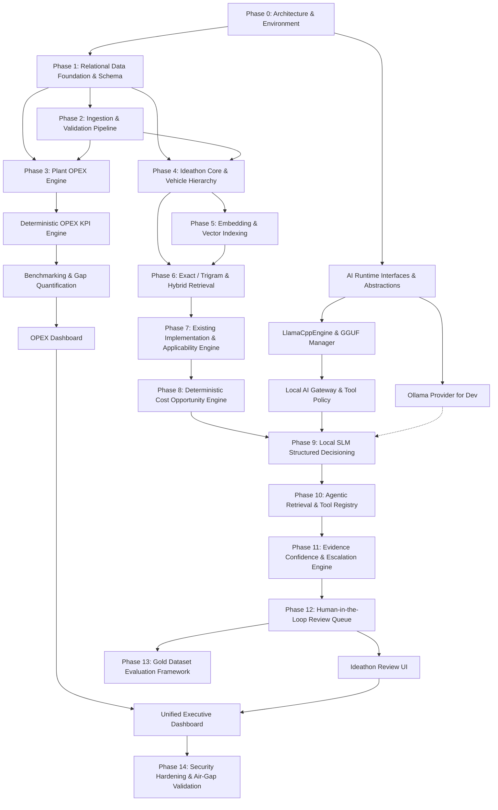

# 02 — System Dependency Graph & Workstream Breakdown

## 1. System Dependency Overview
This document maps all technical, data, business, and runtime dependencies for the Hero Vehicle Cost & Plant OPEX Intelligence Platform. It identifies hard blockers, parallelization paths, and components that can safely be deferred without compromising POC deliverables.

---

## 2. Global Dependency Map

---

## 3. Dependency Classification Matrix

### 3.1 Hard Dependencies (Strict Sequential Blockers)
1. **Schema DDL -> Ingestion Pipeline**: Relational tables (Vehicles, Plants, Parts, OPEX records) must exist before data ingestion and validation can be executed.
2. **Deterministic Calculation Engine -> OPEX Benchmarking**: Raw metrics must be mathematically converted to canonical units (kWh/veh, ₹/veh) before peer comparison or gap analysis.
3. **Structured Hierarchy -> Vehicle / Model / Variant Mapping**: Subsystem, assembly, and component relational tables must exist before ideas can be mapped to engineering entities.
4. **Hybrid Retrieval (Exact + Vector) -> Existing Implementation Search**: Both exact part/ECN matching and semantic similarity must operate before implementation detection can reliably search historical records.
5. **Deterministic Cost Logic -> AI Opportunity Decisioning**: Savings arithmetic ($Saving/veh = Current - Proposed$, $Annual = Saving \times Volume$) must be calculated by the deterministic engine before the SLM synthesizes the final business recommendation.
6. **`AIProvider` Abstraction -> Local SLM Reasoning**: The abstraction layer must be complete before integrating any model provider (Ollama or LlamaCppEngine).

### 3.2 Soft Dependencies (Can Be Mocked / Seeded for Early Development)
1. **Frontend UI -> Backend APIs**: Frontend components can be developed against OpenAPI / Pydantic mock contracts.
2. **Customer Production Data -> Algorithm Validation**: Ingestion, clustering, and benchmarking can be developed and validated using synthetic, clearly labeled test datasets.
3. **Internal `LlamaCppEngine` -> Business Engine**: Business reasoning workflows can use a local `OllamaProvider` during development while `LlamaCppEngine` is being stabilized in parallel.

### 3.3 Independent Parallel Workstreams
- **Workstream 1 (Data & OPEX)**: Ingestion pipeline, unit normalization, OPEX KPI engine, peer benchmark algorithms.
- **Workstream 2 (Ideathon & Retrieval)**: Entity extraction, pgvector indexing, trigram exact matching, reranking, implementation matrix.
- **Workstream 3 (Local AI Runtime)**: `InferenceEngine` interface, `llama-cpp-python` integration, GGUF model registry, tool policy sandbox.
- **Workstream 4 (Frontend UI)**: Responsive layout, OPEX charts, Ideathon review queue, evidence citation panels.
- **Workstream 5 (Evaluation & Test Harness)**: Gold dataset builder, precision/recall harnesses, red-team test suites.

---

## 4. Components Deferred to Post-POC / Production

| Component | Status for POC | Reason for Deferral | Production Re-evaluation Trigger |
|---|---|---|---|
| **Dedicated Graph Database (Neo4j)** | **DEFERRED** | PostgreSQL recursive CTEs satisfy all hierarchical vehicle queries without extra operational overhead. | Hierarchy query depth exceeds 10 levels or real-time graph traversal latency > 200ms. |
| **Model Fine-Tuning (LoRA / QLoRA)** | **DEFERRED** | Changing facts belong in SQL/RAG; zero ROI for initial POC compared to strong in-context prompt grounding. | Post-pilot optimization of model reasoning on Hero-specific engineering jargon. |
| **Multimodal Handwriting / OCR Engine** | **DEFERRED** | 95%+ of Ideathon submissions and OPEX data are digital (Excel/CSV/Text). Basic OCR is sufficient. | High volume of physical paper/handwritten Ideathon cards requiring batch intake. |
| **Recursive Language Model (RLM)** | **DEFERRED** | Standard retrieve-rerank-ground pipelines process up to 10k ideas via batched clustering without complex recursion. | Cross-decade multi-million idea reconciliation requiring iterative recursive synthesis. |
| **Distributed Microservices Mesh** | **DEFERRED** | Modular monolith in FastAPI satisfies single-node on-premise deployment requirements with lower latency and complexity. | Multi-plant distributed deployment requiring independent microservice scaling. |
