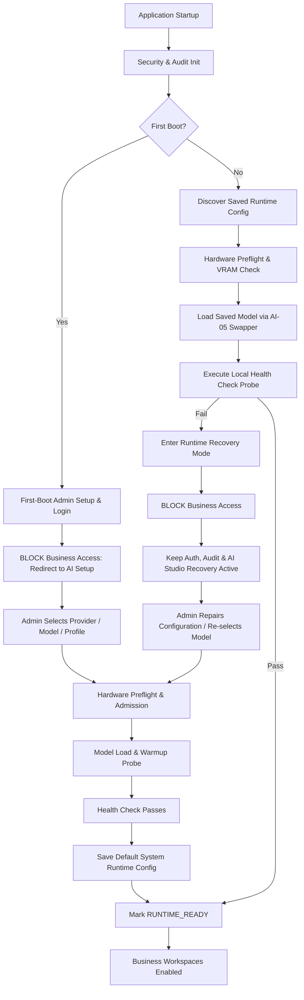
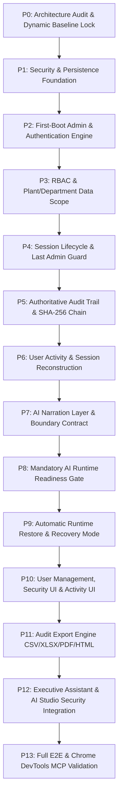

# Hero Cost Intelligence Platform
# Master Implementation Plan: Enterprise Authentication, RBAC, Data Scope, Authoritative Audit, User Activity, AI Session Narration, Runtime Lifecycle & Multi-Format Audit Export

**Document Reference:** `HERO-CI-PLAN-12`  
**Target Version:** `v3.2.0-ENTERPRISE-SECURITY`  
**Status:** PLAN-ONLY FOR STAKEHOLDER REVIEW (NO CODE CHANGES IN THIS TURN)  
**Author:** Enterprise Security & System Architecture Review  

---

## 1. Executive Summary

The Hero Cost Intelligence Platform backend and AI architecture are functionally complete and validated across phases AI-01 through AI-18, delivering deterministic multi-plant OPEX benchmarking, 10K+ vehicle ideathon filtering, safety governance review gates, local GGUF/provider inference, and non-technical Executive Assistant decision intelligence.

This Master Implementation Plan establishes the production-grade **Enterprise Security, Authentication, RBAC, Plant/Department Data Scope, Authoritative Audit, User Activity Monitoring, AI Session Narration, Mandatory AI Runtime Lifecycle, and Audit Export** architecture.

### Architectural Core Invariants:
1. **Authoritative Audit Independence (Layer 1):** Audit logging, user activity monitoring, and session reconstruction operate at Layer 1 and **NEVER** depend on AI. If the AI model or runtime is offline, uninitialized, or crashing, 100% of audit logging, activity tracking, and session reconstruction remain operational.
2. **AI Session Narration as Derived Convenience (Layer 2):** AI narration is strictly a Layer 2 consumer that reads authoritative activity records and produces human-readable summaries with complete model provenance. AI never invents actions or generates primary audit records.
3. **Application Readiness Gate (Zero False-Ready):** The application blocks normal business access until:
   - First-boot Administrator is configured and authenticated.
   - A valid local AI runtime is selected, hardware-prechecked, loaded, and health-verified.
4. **Automatic AI Runtime Restore & Fail-Safe Recovery:** Subsequent system starts automatically restore and load the saved runtime profile. If the saved model is missing or fails health checks, the system enters a safe Runtime Recovery mode, blocking business access while maintaining administrative, security, and audit services.
5. **No Demo / Synthetic Data Cleanup:** All existing synthetic and demonstration datasets remain completely intact throughout this implementation. Demo data cleanup is explicitly out of scope.

---

## 2. Plan-Only Scope & Non-Interference Mandate

This plan is strictly **PLAN-ONLY**. 
- No source code or database changes may occur until this document receives explicit manual stakeholder approval.
- No users are created, no seed scripts modified, and no demo data touched.
- All implementation will proceed strictly phase-by-phase through formal decision gates (`GATE-P00` through `GATE-P13`).

---

## 3. Current Architecture Findings

### 3.1 Backend Architecture
- **Framework:** FastAPI (Python 3.14 async engine).
- **Database:** PostgreSQL 16 + `pgvector` with SQLAlchemy 2.0 async engine (`create_async_engine`, `AsyncSessionLocal` in `backend/app/core/database.py`).
- **Middleware:** `request_tracing_middleware` in `backend/app/main.py` provides `X-Request-ID` tracing and air-gap network egress blocking.
- **AI Subsystem:** Central AI Orchestrator (`ai/orchestrator`), Model Registry (`ai/registry`), Hardware Profiler (`ai/hardware`), Provider Adapters (`ai/providers`), GBNF Grammar Engine (`ai/grammar`), and Local OpenAI-Compatible API (`backend/app/api/v1/endpoints/openai_compat.py`).

### 3.2 Existing Authentication Findings
- `backend/app/core/security.py` contains basic bcrypt hashing (`verify_password`, `get_password_hash`), JWT helpers (`create_access_token`, `decode_access_token`), and `require_roles`.
- `backend/app/api/v1/endpoints/auth.py` currently utilizes an in-memory synthetic dictionary (`SYNTHETIC_USERS`).
- **Gaps Identified:** No database persistence for users, no first-boot administrator detection, no account lockout counters, no session tracking in database, no data scope enforcement (plant/department), no password expiration lifecycle, and no last-admin protection.

### 3.3 Existing Audit Findings
- `database/models/audit.py` defines `AuditLog` table with basic fields (`user_id`, `action`, `entity_type`, `entity_id`, `workflow_id`, `decision`, `override_reason`, `model_version`, `evidence_hash`, `metadata_json`).
- **Gaps Identified:** Audit logging is not invoked uniformly across all business endpoints; no cryptographic hash chain (`previous_event_hash` $\rightarrow$ `event_hash`); no user activity tracking (pages opened, records viewed, searches performed); no session reconstruction; no multi-format audit export (CSV, Excel, PDF, offline Interactive HTML).

### 3.4 Existing AI Runtime Findings
- AI Studio (`frontend/src/components/aistudio/AIStudioWorkspace.tsx`) and backend profiler (`ai/hardware/profiler.py`) provide hardware detection and model scanning.
- **Gaps Identified:** No persisted `system_runtime_configs` table; no blocking startup gate that requires a validated AI runtime before enabling business workspaces; no automatic restore on boot; no safe runtime recovery redirection.

### 3.5 Existing Executive Assistant Findings
- Implemented in `backend/app/api/v1/endpoints/executive_copilot.py` and `frontend/src/components/executive/ExecutiveCopilotWorkspace.tsx`.
- Automatically resolves persona presentation styling on the backend based on RBAC headers and workspace context (`OPEX` $\rightarrow$ `PLANT_HEAD`, `PURCHASE` $\rightarrow$ `PURCHASE`, `IDEATHON` $\rightarrow$ `VAVE_COMMERCIAL`, `OVERVIEW` $\rightarrow$ `CEO`).

---

## 4. TASC Reference Mapping & Hero Boundaries

| TASC Reference Concept | Hero Cost Intelligence Target Mapping | Adaptation / Hero Boundary |
|:---|:---|:---|
| First-boot Setup Screen | `FirstBootAdminSetupModal.tsx` & `/api/v1/auth/bootstrap-admin` | Triggered when `users` table has 0 active `ADMINISTRATOR` records. |
| Inactivity & Session Lifecycle | `UserSession` model + server-side session token + 8hr inactivity | Server is authoritative. LocalStorage is only UI cache. |
| Account Lockout & Rate Limit | 5 failed login attempts $\rightarrow$ 5 min lockout | Persisted in DB (`failed_login_attempts`, `locked_until`). |
| Role & Permission Matrix | Hero Enterprise Roles (7 roles, 18 permissions) | Strictly automotive/cost engineering permissions (NO SCADA/PLC). |
| Last Administrator Guard | SQL & Service check blocking delete/disable/demote of final admin | Backend constraint enforcing $\ge 1$ active `ADMINISTRATOR`. |
| Audit Trail & Hash Chain | SHA-256 canonical event hash chain | Tamper-evident hash chain linking sequential audit records. |
| Audit Export (4 Formats) | CSV, Excel (.xlsx), PDF, Self-Contained Offline HTML | Local, air-gapped generation; export actions audited. |
| SCADA / Control Features | **OUT OF SCOPE** | Zero SCADA, PLC, MQTT, OPC-UA, or machine-control code. |

---

## 5. Gap Analysis

1. **Security & Identity:** Missing persistent Argon2id password hashing, first-boot detection, account lockout, and last-admin protection.
2. **Access Control:** Missing server-enforced plant and department data scopes.
3. **Audit & Activity:** Missing tamper-evident SHA-256 hash chaining, semantic user activity logging, and session timeline reconstruction.
4. **AI Narration Layer:** Missing structured conversion of activity timelines into factual narrative summaries with model provenance.
5. **Runtime Lifecycle:** Missing persistent default runtime configuration, automatic boot restore, readiness gating, and fail-safe recovery mode.
6. **Audit Export:** Missing server-side generation of CSV, XLSX, PDF, and 100% offline self-contained Interactive HTML exports.

---

## 6. Target Architecture & Layered System Design

```
+---------------------------------------------------------------------------------------------------+
|                                      HERO WEB CLIENT (REACT + TS)                                |
|  [ Login / First-Boot Setup ]  [ Business Workspaces (OPEX / Ideathon / Sourcing) ]  [ AI Studio ]|
|  [ Executive Assistant ]       [ Security & Audit Management ]                       [ Activity ] |
+---------------------------------------------------------------------------------------------------+
                                                  |
                                                  v
+---------------------------------------------------------------------------------------------------+
|                                     FASTAPI API GATEWAY (PORT 8000)                               |
|  +-----------------------------------+  +------------------------------------------------------+  |
|  |     SECURITY & AUTHENTICATION     |  |               APPLICATION READINESS GATE             |  |
|  |  - JWT / Session Validation       |  |  - Admin Initialized?                                |  |
|  |  - RBAC & Permission Checker      |  |  - AI Runtime Initialized & Health Verified?         |  |
|  |  - Plant / Department Data Scope  |  |  - Blocks Protected Business APIs if Unready         |  |
|  +-----------------------------------+  +------------------------------------------------------+  |
+---------------------------------------------------------------------------------------------------+
                                                  |
         +----------------------------------------+----------------------------------------+
         |                                                                                 |
         v                                                                                 v
+------------------------------------+                           +------------------------------------+
|    LAYER 1: AUTHORITATIVE AUDIT    |                           |     LAYER 2: LOCAL AI RUNTIME      |
|  (MANDATORY & INDEPENDENT OF AI)   |                           |    (DERIVED CONVENIENCE LAYER)     |
|                                    |                           |                                    |
|  * Audit Log Service (Canonical)   |                           |  * Central AI Orchestrator (AI-12) |
|  * SHA-256 Tamper-Evident Chain    |                           |  * Model Registry & GGUF (AI-02/04)|
|  * User Activity Stream            |                           |  * Hardware Preflight (AI-03)      |
|  * Session Reconstruction Engine   |                           |  * Evidence Grounding (AI-09)      |
|  * Multi-Format Exporter           |                           |  * AI Session Narrator             |
|    (CSV, XLSX, PDF, Offline HTML)  |                           |    (Reads Layer 1, Never Writes)   |
+------------------------------------+                           +------------------------------------+
         |                                                                                 |
         v                                                                                 v
+---------------------------------------------------------------------------------------------------+
|                               POSTGRESQL 16 + PGVECTOR RELATIONAL STORE                           |
|  - users                     - user_sessions            - security_policies                      |
|  - roles_permissions         - audit_trail_events       - user_activity_events                   |
|  - system_runtime_configs    - audit_exports            - session_narrations                     |
+---------------------------------------------------------------------------------------------------+
```

---

## 7. Security Model & Authentication Architecture

### 7.1 First-Boot Administrator Setup
- **Endpoint:** `GET /api/v1/auth/bootstrap-status` returns `{"is_bootstrapped": false}` when zero active `ADMINISTRATOR` accounts exist in `users`.
- **Setup API:** `POST /api/v1/auth/bootstrap-admin` accepts `username`, `display_name`, `password`, `confirm_password`.
- Hashes password using **Argon2id** (salt length: 16 bytes, time cost: 3, memory cost: 64 MB, parallelism: 4).
- Creates the initial Administrator and emits authoritative audit event `SYSTEM_BOOTSTRAPPED`.

### 7.2 Authentication & Session Lifecycle
- **Login API:** `POST /api/v1/auth/login` validates credentials, checks lockout state, creates an active `user_sessions` record, and returns a signed JWT containing `session_id`, `user_id`, `username`, `roles`, and `plant_scope`.
- **Session Introspection:** `GET /api/v1/auth/session` validates the active session in DB, updates `last_activity_at`, and enforces the 8-hour inactivity timeout.
- **Logout API:** `POST /api/v1/auth/logout` explicitly deactivates the session token in the database and records `AUTH_LOGOUT`.

### 7.3 Account Lockout & Security Persistence
- Tracked in `users`: `failed_login_attempts: int`, `locked_until: Optional[datetime]`, `last_failed_login_at: Optional[datetime]`.
- 5 consecutive failed attempts lock the account for 5 minutes.
- Administrator can unlock accounts via `POST /api/v1/users/{id}/unlock`.

### 7.4 Last-Administrator Protection Guard
- Server-side guard prevents deleting, disabling (`is_active=False`), or demoting the role of an Administrator if no other active Administrator exists.
- Throws `HTTP 400 Bad Request: Cannot deactivate or demote the last remaining active Administrator`.

### 7.5 Test-Only Mock Authentication Isolation
> [!CAUTION]
> **Strict Security Invariant:** Mock users and mock tokens are permitted **ONLY** inside isolated automated test fixtures (`tests/conftest.py`). They MUST NOT be enabled in production, loaded during normal startup, accepted by production auth middleware, exposed by fallback routes, or used by normal user sessions.

---

## 8. Role-Based Access Control (RBAC) & Data Scope

### 8.1 Hero Role & Permission Matrix

| Role | Description | Assigned Permissions |
|:---|:---|:---|
| `ADMINISTRATOR` | System & User Administration | `MANAGE_USERS`, `MANAGE_SYSTEM_SETTINGS`, `MANAGE_RUNTIME`, `MANAGE_MODELS`, `MANAGE_PROVIDERS`, `READ_AUDIT`, `EXPORT_AUDIT`, `READ_USER_ACTIVITY`, `READ_DASHBOARD`, `READ_OPEX`, `READ_IDEATHON`, `READ_OPPORTUNITY`, `READ_GOVERNANCE`, `INGEST_DATA`, `RUN_AI` |
| `CENTRAL_OPERATIONS` | Multi-Plant Cost Leadership | `READ_DASHBOARD`, `READ_OPEX`, `READ_IDEATHON`, `READ_OPPORTUNITY`, `READ_GOVERNANCE`, `INGEST_DATA`, `EXPORT_DATA`, `RUN_ANALYSIS`, `RUN_AI`, `READ_USER_ACTIVITY` |
| `PLANT_HEAD` | Single-Plant Leadership (e.g. Haridwar) | `READ_DASHBOARD`, `READ_OPEX`, `READ_IDEATHON`, `READ_OPPORTUNITY`, `RUN_ANALYSIS`, `RUN_AI` (Scoped to assigned plant) |
| `PURCHASE` | Sourcing & Commercial BOM | `READ_DASHBOARD`, `READ_OPPORTUNITY`, `READ_IDEATHON`, `RUN_ANALYSIS`, `RUN_AI`, `EXPORT_DATA` (Scoped to sourcing data) |
| `COMMERCIAL_VAVE` | VAVE Engineering & Ideathon | `READ_DASHBOARD`, `READ_IDEATHON`, `READ_ENGINEERING_EVIDENCE`, `READ_OPPORTUNITY`, `READ_GOVERNANCE`, `RUN_ANALYSIS`, `RUN_AI` |
| `ENGINEERING` | R&D and Homologation | `READ_DASHBOARD`, `READ_IDEATHON`, `READ_ENGINEERING_EVIDENCE`, `RUN_AI` |
| `VIEWER` | Read-Only Executive Stakeholder | `READ_DASHBOARD`, `RUN_AI` |

### 8.2 Plant & Department Data Scope Enforcement
- Users possess `plant_scope: List[str]` (e.g. `["HARIDWAR"]`, `["DHARUHERA"]`, `["NEEMRANA"]`, `["ALL"]`).
- Injected backend dependency `require_data_scope(plant_param="plant_id")` intercepts route queries.
- If a Plant Head with scope `["HARIDWAR"]` calls `/api/v1/opex/plants/DHARUHERA/kpis`, the server rejects the request with `HTTP 403 Forbidden: Plant 'DHARUHERA' is outside authorized plant scope`.

---

## 9. Layer 1: Authoritative Audit Trail & User Activity Monitoring

### 9.1 Tamper-Evident SHA-256 Audit Trail
- Every significant system action generates a canonical audit event record.
- **Cryptographic Hash Chaining:**
  ```python
  payload_canonical = json.dumps(payload_json, sort_keys=True, separators=(',', ':'))
  raw_str = f"{sequence_number}:{timestamp.isoformat()}:{username}:{action}:{entity_type}:{entity_id}:{status}:{session_id}:{previous_event_hash}:{payload_canonical}"
  event_hash = "sha256:" + hashlib.sha256(raw_str.encode("utf-8")).hexdigest()
  ```
- **Integrity Verification API:** `GET /api/v1/audit/verify-integrity` traverses the entire event chain and confirms each `previous_event_hash` and `event_hash`.

### 9.2 Semantic User Activity Monitoring & Session Reconstruction
- Records meaningful actions: `PAGE_OPENED`, `PLANT_SELECTED`, `RECORD_VIEWED`, `BENCHMARK_COMPARED`, `IDEA_INVESTIGATED`, `EVIDENCE_OPENED`, `DECISION_RECORDED`, `DATA_EXPORTED`.
- **Exclusions:** Zero recording of mouse movements, keystrokes, or raw UI noise.
- **Session Reconstruction Engine (`GET /api/v1/activity/sessions/{session_id}/timeline`):** Assembles a chronologically ordered step-by-step workflow timeline for any user session.

---

## 10. Layer 2: AI Session Narration Architecture

### 10.1 Derived Narration Integration Boundary
- AI Narration is strictly a **downstream consumer** of Layer 1 authoritative activity records.
- Input: Chronologically ordered, factual session timeline.
- Output: Plain-language executive summary detailing actions taken, plant scopes explored, and decisions recorded.
- **Provenance Attributes:** `session_id`, `narration_id`, `generated_at`, `model_id`, `model_hash`, `source_event_count`, `source_event_hash_range`, `status`.
- **Factual Policy:** AI is forbidden from inventing actions, intent, hidden decisions, or figures not in the source events.

### 10.2 Graceful Fallback on AI Offline
- If AI runtime is uninitialized or offline, the session activity workspace displays the complete raw chronological timeline with a status badge: `"AI Narration Unavailable — Local Model Offline"`.
- Raw activity and audit records are 100% accessible at all times.

---

## 11. Mandatory AI Runtime Initialization & Readiness Gate

### 11.1 Lifecycle States



### 11.2 Central Application Readiness Gate
- Dependency: `require_application_ready(current_user: UserSession = Depends(get_current_user))`
- Injected into all protected business routers (`opex`, `ideathon`, `opportunity`, `governance`, `ingestion`, `executive_copilot`).
- Unready state throws `HTTP 503 Service Unavailable: AI Runtime is not initialized or failed health probe. Administrative recovery required.`

---

## 12. Multi-Format Audit Export Engine

Supports 4 user-facing formats generated locally and air-gapped without external network calls:

1. **CSV Export (`GET /api/v1/audit/export/csv`):** RFC 4180 streaming format with full event details and hash fields.
2. **Excel Export (`GET /api/v1/audit/export/xlsx`):** Multi-sheet workbook (`Audit Events`, `Export Metadata`, `Integrity Summary`) via `openpyxl`.
3. **PDF Export (`GET /api/v1/audit/export/pdf`):** Printable report with Hero branding, filter parameters, and cryptographic verification footer via `reportlab`.
4. **Interactive Offline HTML Export (`GET /api/v1/audit/export/html`):** Single-file self-contained HTML.
   - **Zero External Resources:** Inline CSS and JavaScript. No CDNs, no Google Fonts, no telemetry.
   - Includes client-side table sorting, real-time search, expandable event detail drawer, and `@media print` layout.
- **Export Invariant:** Every export execution records a `DATA_EXPORTED` audit event capturing requesting user, session ID, format, filter criteria, and record count.

---

## 13. Target / Conceptual Database Schema

> [!NOTE]
> **Pre-Implementation Reconciliation Rule:** The schemas below represent the target conceptual design. During Phase P1, each entity must be reconciled against existing SQLAlchemy models (`database/models/auth.py`, `database/models/audit.py`) and classified as **REUSE**, **MODIFY**, **NEW**, **MIGRATE**, or **DEPRECATE**.

```sql
-- TARGET / CONCEPTUAL SCHEMAS (Subject to P1 Entity Reconciliation)

-- 1. Enhanced Users Table (MODIFY existing database/models/auth.py User)
CREATE TABLE IF NOT EXISTS users (
    id VARCHAR(36) PRIMARY KEY,
    username VARCHAR(100) UNIQUE NOT NULL,
    email VARCHAR(255) UNIQUE NOT NULL,
    display_name VARCHAR(255) NOT NULL,
    hashed_password VARCHAR(255) NOT NULL,
    department VARCHAR(100) NOT NULL DEFAULT 'ENGINEERING',
    plant_scope JSONB NOT NULL DEFAULT '["ALL"]'::jsonb,
    role VARCHAR(50) NOT NULL DEFAULT 'VIEWER',
    is_active BOOLEAN NOT NULL DEFAULT TRUE,
    is_superuser BOOLEAN NOT NULL DEFAULT FALSE,
    failed_login_attempts INT NOT NULL DEFAULT 0,
    locked_until TIMESTAMP WITH TIME ZONE NULL,
    password_changed_at TIMESTAMP WITH TIME ZONE NOT NULL DEFAULT CURRENT_TIMESTAMP,
    last_login_at TIMESTAMP WITH TIME ZONE NULL,
    created_at TIMESTAMP WITH TIME ZONE NOT NULL DEFAULT CURRENT_TIMESTAMP,
    updated_at TIMESTAMP WITH TIME ZONE NOT NULL DEFAULT CURRENT_TIMESTAMP
);

-- 2. User Sessions Table (NEW)
CREATE TABLE IF NOT EXISTS user_sessions (
    id VARCHAR(36) PRIMARY KEY,
    user_id VARCHAR(36) NOT NULL REFERENCES users(id) ON DELETE CASCADE,
    session_token VARCHAR(255) UNIQUE NOT NULL,
    client_ip VARCHAR(45) NULL,
    user_agent VARCHAR(500) NULL,
    is_active BOOLEAN NOT NULL DEFAULT TRUE,
    created_at TIMESTAMP WITH TIME ZONE NOT NULL DEFAULT CURRENT_TIMESTAMP,
    last_activity_at TIMESTAMP WITH TIME ZONE NOT NULL DEFAULT CURRENT_TIMESTAMP,
    expires_at TIMESTAMP WITH TIME ZONE NOT NULL
);

-- 3. Security Policy Configuration Table (NEW)
CREATE TABLE IF NOT EXISTS security_policies (
    id VARCHAR(36) PRIMARY KEY,
    min_password_length INT NOT NULL DEFAULT 8,
    require_uppercase BOOLEAN NOT NULL DEFAULT TRUE,
    require_lowercase BOOLEAN NOT NULL DEFAULT TRUE,
    require_digit BOOLEAN NOT NULL DEFAULT TRUE,
    require_special_char BOOLEAN NOT NULL DEFAULT TRUE,
    max_failed_attempts INT NOT NULL DEFAULT 5,
    lockout_duration_minutes INT NOT NULL DEFAULT 5,
    session_inactivity_timeout_minutes INT NOT NULL DEFAULT 480,
    password_expiration_days INT NOT NULL DEFAULT 0,
    updated_by VARCHAR(36) NULL REFERENCES users(id),
    updated_at TIMESTAMP WITH TIME ZONE NOT NULL DEFAULT CURRENT_TIMESTAMP
);

-- 4. Authoritative Tamper-Evident Audit Events (MODIFY database/models/audit.py)
CREATE TABLE IF NOT EXISTS audit_trail_events (
    id VARCHAR(36) PRIMARY KEY,
    sequence_number BIGSERIAL UNIQUE NOT NULL,
    timestamp TIMESTAMP WITH TIME ZONE NOT NULL DEFAULT CURRENT_TIMESTAMP,
    user_id VARCHAR(36) NULL,
    username VARCHAR(100) NOT NULL,
    role VARCHAR(50) NOT NULL,
    department VARCHAR(100) NULL,
    scope VARCHAR(100) NULL,
    action VARCHAR(100) NOT NULL,
    entity_type VARCHAR(100) NOT NULL,
    entity_id VARCHAR(100) NULL,
    status VARCHAR(50) NOT NULL DEFAULT 'SUCCESS',
    client_ip VARCHAR(45) NULL,
    session_id VARCHAR(36) NULL,
    correlation_id VARCHAR(36) NULL,
    payload_json JSONB NOT NULL DEFAULT '{}'::jsonb,
    previous_event_hash VARCHAR(64) NOT NULL,
    event_hash VARCHAR(64) NOT NULL
);

-- 5. User Activity Events Table (NEW)
CREATE TABLE IF NOT EXISTS user_activity_events (
    id VARCHAR(36) PRIMARY KEY,
    session_id VARCHAR(36) NOT NULL,
    user_id VARCHAR(36) NOT NULL REFERENCES users(id) ON DELETE CASCADE,
    username VARCHAR(100) NOT NULL,
    activity_type VARCHAR(100) NOT NULL,
    page VARCHAR(100) NOT NULL,
    plant_id VARCHAR(50) NULL,
    entity_type VARCHAR(100) NULL,
    entity_id VARCHAR(100) NULL,
    details_json JSONB NOT NULL DEFAULT '{}'::jsonb,
    timestamp TIMESTAMP WITH TIME ZONE NOT NULL DEFAULT CURRENT_TIMESTAMP
);

-- 6. System AI Runtime Configuration Table (NEW)
CREATE TABLE IF NOT EXISTS system_runtime_configs (
    id VARCHAR(36) PRIMARY KEY,
    is_default BOOLEAN NOT NULL DEFAULT TRUE,
    provider VARCHAR(50) NOT NULL,
    model_id VARCHAR(100) NOT NULL,
    model_hash VARCHAR(64) NOT NULL,
    runtime_profile VARCHAR(50) NOT NULL,
    context_length INT NOT NULL DEFAULT 4096,
    gpu_layers INT NOT NULL DEFAULT -1,
    is_active BOOLEAN NOT NULL DEFAULT TRUE,
    last_health_verified_at TIMESTAMP WITH TIME ZONE NULL,
    configured_by VARCHAR(36) NULL REFERENCES users(id),
    created_at TIMESTAMP WITH TIME ZONE NOT NULL DEFAULT CURRENT_TIMESTAMP,
    updated_at TIMESTAMP WITH TIME ZONE NOT NULL DEFAULT CURRENT_TIMESTAMP
);
```

---

## 14. File & Module Impact Map

| File / Module | Current Responsibility | Change Type | Reason | Dependency | Risk | Phase |
|:---|:---|:---|:---|:---|:---|:---|
| `database/models/auth.py` | Basic User model | **MODIFY** | Add `display_name`, `plant_scope`, lockout, and password expiry fields | SQLAlchemy / Base | Low | P1 |
| `database/models/audit.py` | Basic AuditLog model | **MODIFY** | Add sequence number, hash chain fields, session ID | SQLAlchemy / Base | Low | P1 |
| `database/models/session.py` | None | **NEW** | Store active server-side user sessions and inactivity timestamps | `auth.py` | Low | P1 |
| `database/models/runtime_config.py` | None | **NEW** | Persist default AI runtime profile and health verification state | `base.py` | Low | P1 |
| `backend/app/core/security.py` | Bcrypt & JWT helpers | **MODIFY** | Upgrade to Argon2id, add session token verification, last-admin checks | `passlib`/`argon2` | Med | P2 |
| `backend/app/api/v1/endpoints/auth.py` | Synthetic auth prototype | **MODIFY** | Implement DB-backed bootstrap, login, logout, password change | `security.py` | High | P2 |
| `backend/app/api/v1/endpoints/users.py` | None | **NEW** | Administrator user management CRUD, unlocking, role/scope assignment | `auth.py` | Med | P10 |
| `backend/app/api/v1/endpoints/audit.py` | Basic log fetcher | **MODIFY** | Implement filtered search, SHA-256 chain verification, 4 export streams | `AuditService` | Med | P5, P11 |
| `backend/app/api/v1/endpoints/activity.py` | None | **NEW** | Record activity events, reconstruct timelines, trigger AI narration | `AuditService` | Med | P6, P7 |
| `backend/app/api/v1/endpoints/system.py` | Hardware profile endpoint | **MODIFY** | Add runtime readiness checks, initialization, and recovery endpoints | `ai/hardware` | High | P8, P9 |
| `backend/app/api/v1/endpoints/executive_copilot.py` | Executive Assistant query | **MODIFY** | Enforce authenticated identity and user plant scope | `security.py` | Med | P12 |
| `frontend/src/App.tsx` | Main routing & layouts | **MODIFY** | Mount AuthContext, readiness gates, and recovery screens | React context | High | P10 |
| `frontend/src/context/AuthContext.tsx` | None | **NEW** | Client authentication state, session refresh, role/scope providers | React | High | P2 |
| `frontend/src/context/SystemReadinessContext.tsx` | None | **NEW** | Authoritative backend readiness and runtime state management | React | High | P8 |
| `frontend/src/components/audit/AuditLogWorkspace.tsx`| Prototype log table | **MODIFY** | Full filter bar, integrity verification badge, 4 export buttons | `copilotApi` | Med | P10, P11 |
| `frontend/src/components/activity/UserActivityWorkspace.tsx`| None | **NEW** | Session workflow timeline view and AI narration card | React | Med | P10 |
| `frontend/src/components/users/UserManagementWorkspace.tsx`| None | **NEW** | Administrator user management table and edit drawers | React | Med | P10 |

---

## 15. Corrected Phase-Wise Implementation Plan & Decision Gates



### Phase P0: Architecture Discovery & Dynamic Baseline Lock
- **Objective:** Re-verify all backend/frontend modules, database connectivity, and record the exact dynamic test baseline.
- **Exit Gate GATE-P00:** Baseline test counts recorded; clean run of pytest and npm test; zero regressions.

### Phase P1: Security & Persistence Foundation (Entity Reconciliation)
- **Objective:** Reconcile existing ORM models against target schema and generate Alembic migrations for `users`, `user_sessions`, `security_policies`, `audit_trail_events`, `user_activity_events`, and `system_runtime_configs`.
- **Exit Gate GATE-P01:** Schema migrations apply cleanly on PostgreSQL 16; ORM models pass unit tests.

### Phase P2: First-Boot Administrator Setup & Authentication Engine
- **Objective:** Implement `bootstrap-status`, `bootstrap-admin`, `login`, `logout`, Argon2id password hashing, and failed login lockout.
- **Exit Gate GATE-P02:** Fresh DB prompts admin setup; lockout triggers after 5 failed logins; session tokens created.

### Phase P3: RBAC & Plant/Department Data Scope Enforcement
- **Objective:** Implement 7 Hero roles, 18 permissions, and server-enforced `require_data_scope` dependency on all business routes.
- **Exit Gate GATE-P03:** Role matrix tests pass; Plant Head cannot query unauthorized plant endpoints.

### Phase P4: Session Lifecycle, Last-Admin Guard & Password Policy
- **Objective:** Implement server-side session management, last-admin protection constraint, and configurable password policies.
- **Exit Gate GATE-P04:** Deleting/demoting the final active administrator is strictly blocked; password complexity enforced.

### Phase P5: Authoritative Audit Trail & SHA-256 Hash Chain (Layer 1)
- **Objective:** Implement `AuditService` with canonical SHA-256 hash chaining linking sequential events. Wire into all API endpoints.
- **Exit Gate GATE-P05:** Integrity verifier validates event chain; tampering fails verification; audit operates independently of AI.

### Phase P6: User Activity Monitoring & Session Reconstruction
- **Objective:** Implement `user_activity_events` logging across client/server and session timeline reconstruction engine.
- **Exit Gate GATE-P06:** Chronological session timeline faithfully reflects user actions without missing steps.

### Phase P7: AI Session Narration Layer & Integration Boundary (Layer 2)
- **Objective:** Establish narration contract, provenance models, and AI-12 integration boundary.
- **Exit Gate GATE-P07:** Narration service formats activity timelines; offline model triggers `"AI Narration Unavailable"` without impacting audit.

### Phase P8: Mandatory AI Runtime Initialization & Readiness Gate
- **Objective:** Implement backend `require_application_ready` gate and frontend `RuntimeInitializationGate`. Blocks business access if uninitialized.
- **Exit Gate GATE-P08:** Uninitialized runtime blocks business APIs with HTTP 503; Admin setup successfully initializes runtime.

### Phase P9: Automatic Runtime Restore & Fail-Safe Recovery Mode
- **Objective:** Implement automatic model restore on boot and recovery redirection if model file or health probe fails.
- **Exit Gate GATE-P09:** Application startup automatically loads saved profile; corrupted model safely triggers Recovery Mode.

### Phase P10: User Management, Security UI & Activity UI
- **Objective:** Build React components for user management, user activity timelines, security policies, and updated header/sidebar.
- **Exit Gate GATE-P10:** Administrator can create, edit, unlock users, and inspect session timelines in the browser.

### Phase P11: Multi-Format Audit Export Engine (CSV, Excel, PDF, Offline HTML)
- **Objective:** Implement local generation and download for CSV, XLSX, PDF, and self-contained offline Interactive HTML.
- **Exit Gate GATE-P11:** All 4 export formats generate properly; offline HTML functions without network requests; export events are audited.

### Phase P12: Executive Assistant & AI Studio Security Integration
- **Objective:** Integrate Executive Assistant with authenticated user identity, RBAC, and data scope; protect AI Studio administration controls.
- **Exit Gate GATE-P12:** Executive Assistant queries inherit user plant scope; unauthorized model operations in AI Studio are blocked.

### Phase P13: Comprehensive Browser MCP Validation & Security Red Teaming
- **Objective:** Execute live Chrome DevTools MCP validation across all 13 core operational workflows (MCP-01 to MCP-13) in Light and Dark modes.
- **Exit Gate GATE-P13:** 100% test pass rate across backend pytest, frontend test suites, security test matrix, and Chrome DevTools MCP live session.

---

## 16. Chrome DevTools MCP Live Browser Validation Protocols

| Scenario ID | Test Name | Role / User | Action | Expected Result | Pass / Fail |
|:---|:---|:---|:---|:---|:---|
| `MCP-01` | First-Boot Admin Setup | Anonymous $\rightarrow$ Admin | Load fresh app, fill setup form, submit | Admin account created, JWT issued, redirected to AI Setup | `PENDING` |
| `MCP-02` | Mandatory AI Runtime Setup | Admin | Select Qwen GGUF, verify preflight, load | Model loaded, saved as default, app marked READY | `PENDING` |
| `MCP-03` | Subsequent Boot Auto-Restore | Admin | Restart backend, login | Saved model automatically loaded, zero manual reselection | `PENDING` |
| `MCP-04` | User Creation & Scope | Admin | Create Plant Head for Haridwar | User created with scope `["HARIDWAR"]`, audit event logged | `PENDING` |
| `MCP-05` | Cross-Plant Access Denial | Plant Head (Haridwar) | Attempt to view Dharuhera plant OPEX | View blocked with scope restriction notice | `PENDING` |
| `MCP-06` | Full Workflow Activity Tracking | Cost Engineer | Browse OPEX $\rightarrow$ Ideathon $\rightarrow$ Evidence $\rightarrow$ Review | All steps chronologically recorded in user activity stream | `PENDING` |
| `MCP-07` | AI Session Narration | Admin | View session timeline & trigger narration | Accurate narrative generated from recorded events | `PENDING` |
| `MCP-08` | CSV Audit Export | Admin | Click "Export CSV" | RFC 4180 CSV downloaded with matching record count | `PENDING` |
| `MCP-09` | Excel Audit Export | Admin | Click "Export Excel (.xlsx)" | Formatted workbook downloaded with 3 sheets | `PENDING` |
| `MCP-10` | PDF Audit Export | Admin | Click "Export PDF" | Printable air-gapped PDF downloaded with hash footer | `PENDING` |
| `MCP-11` | Interactive Offline HTML Export | Admin | Click "Export HTML", open locally | Self-contained HTML opens offline; search & sort work | `PENDING` |
| `MCP-12` | Runtime Failure & Recovery | Admin | Delete model file, restart backend | System enters Recovery Mode; business access gated | `PENDING` |
| `MCP-13` | AI Studio Admin Authorization | Admin vs Non-Admin | Admin loads model (allowed); Non-Admin tries (denied) | Admin action succeeds with audit; Non-Admin blocked with 403 | `PENDING` |

---

## 17. Security Threat Model & Defense Matrix

| Threat Vector | Attack Scenario | Defensive Countermeasure & Test |
|:---|:---|:---|
| **Forged Role Header** | Attacker injects `X-User-Role: ADMINISTRATOR` in HTTP request | Backend derives roles **strictly** from cryptographically signed JWT session token. Direct header injection is rejected. |
| **Cross-Plant Data Leak** | Haridwar Plant Head requests `/api/v1/opex/plants/DHARUHERA/kpis` | `require_data_scope` validates user `plant_scope` against route param; returns `HTTP 403 Forbidden`. |
| **Brute-Force Login** | Attacker attempts automated password guessing | `users.failed_login_attempts` locks account for 5 minutes after 5 consecutive failures. |
| **Audit Log Tampering** | Attacker modifies row in `audit_trail_events` directly | `GET /api/v1/audit/verify-integrity` detects mismatch in `previous_event_hash` and `event_hash` chain. |
| **Frontend Bypass of AI Gate** | Attacker changes frontend state in devtools to bypass runtime gate | Protected business endpoints enforce `require_application_ready` dependency on server. Direct API calls fail with `HTTP 503`. |
| **Last-Admin Lockout** | Admin attempts to deactivate or delete only active administrator | Service layer validates count of remaining active admins $\ge 1$; returns `HTTP 400 Bad Request`. |
| **Credential Leak in Export** | Admin exports audit history containing auth events | Audit payload serializer strictly redacts passwords, tokens, API keys, and secret credentials. |
| **External Resource Leak in HTML Export** | Offline HTML export attempts to fetch Google Fonts or CDN script | HTML export embeds all CSS/JS inline and contains strict `<meta http-equiv="Content-Security-Policy" content="default-src 'none'; style-src 'unsafe-inline'; script-src 'unsafe-inline';">`. |

---

## 18. Known Unknowns & Implementation-Time Discoveries

1. **Argon2id Library Native Compilation:** Verify Windows Python 3.14 wheel compatibility for `argon2-cffi` vs pure-Python/PBKDF2-SHA256 fallback.
2. **ReportLab Air-Gapped Font Bundling:** Ensure default Helvetica / Times Roman standard typefaces are used without attempting system font downloads.
3. **Session Reconnection on Fast Backend Restart:** Verify token re-validation behavior when backend uvicorn worker restarts while frontend client holds valid JWT.

---

## 19. Final Readiness Criteria

The overall implementation is complete only when all 33 criteria are satisfied:

- [ ] First-boot administrator setup functions seamlessly on clean installation.
- [ ] User login, session management, and logout function securely.
- [ ] Passwords hashed with Argon2id; zero plaintext credentials stored or logged.
- [ ] 5 consecutive failed logins trigger 5-minute temporary lockout.
- [ ] 7 Hero roles and 18 granular permissions enforced on backend.
- [ ] Plant and department data scopes strictly enforced on backend.
- [ ] Last active administrator cannot be deleted, deactivated, or demoted.
- [ ] Audit trail functions 100% independently of AI availability.
- [ ] Audit events form an unbroken SHA-256 cryptographic chain.
- [ ] User activity stream records semantic navigation, views, and decisions.
- [ ] Session reconstruction engine assembles ordered chronological timelines.
- [ ] AI session narration generates factual summaries with model provenance.
- [ ] AI narration failure gracefully degrades without breaking audit access.
- [ ] First boot requires validated AI runtime before business access.
- [ ] Subsequent boot automatically restores and health-checks saved runtime.
- [ ] Missing or corrupted model safely triggers Runtime Recovery mode.
- [ ] Backend readiness gate blocks direct API bypass attempts.
- [ ] Executive Assistant respects authenticated user role and plant scope.
- [ ] AI Studio administration controls restricted to authorized administrators.
- [ ] CSV audit export generated locally according to RFC 4180.
- [ ] Excel (.xlsx) audit workbook generated with metadata and integrity sheets.
- [ ] Printable air-gapped PDF audit report generated with cryptographic footer.
- [ ] Interactive HTML export operates 100% offline without external CDN/fonts.
- [ ] Every export operation generates an immutable `DATA_EXPORTED` audit event.
- [ ] Zero sensitive credentials, tokens, or raw passwords exported.
- [ ] Exactly 13 Chrome DevTools MCP browser validation scenarios (MCP-01 to MCP-13) pass.
- [ ] Backend security test matrix passes (privilege escalation, cross-scope).
- [ ] Full backend regression test suite passes with zero regressions against P0 baseline.
- [ ] Frontend test suites pass with zero regressions against P0 baseline.
- [ ] Production bundle build (`npm run build`) compiles cleanly.
- [ ] No demo or synthetic dataset cleanup performed in this scope.
- [ ] Master documentation and Help Manual updated.

---

**END OF MASTER IMPLEMENTATION PLAN**
